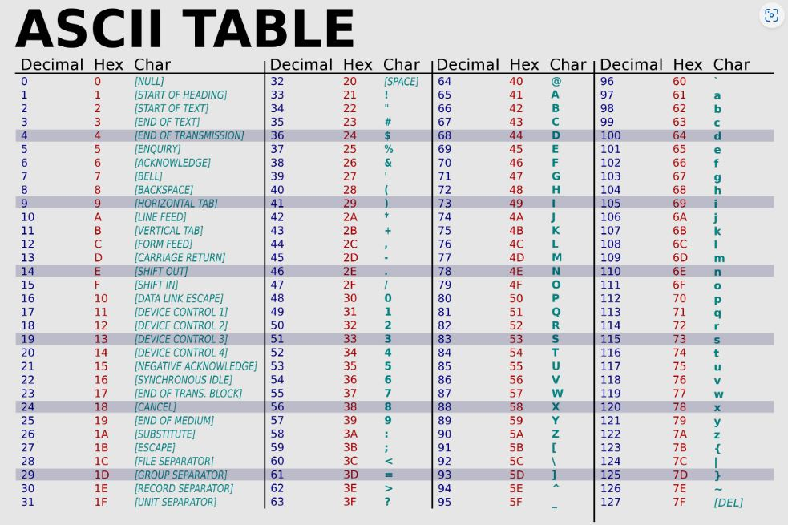
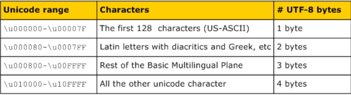

## Basic Programming Concepts
*Following are some of the important programming concepts.*

### 1. What's ASCII?
ASCII (American Standard Code for Information Interchange) is a character encoding standard that assigns a unique 7-bit binary number to each alphanumeric character, punctuation mark, and control character used in English text. It was widely used in early computer systems and communication protocols.

Characters in ASCII encoding include upper and lowercase letters A through Z, numerals 0 through 9 and basic punctuation symbols. It also uses some non-printing control characters that were originally intended for use with teletype printing terminals.

ASCII characters may be represented in the following ways:

* as pairs of hexadecimal digits -- base-16 numbers, represented as 0 through 9 and A through F for the decimal values of 10-15;
* as three-digit octal (base 8) numbers;
* as decimal numbers from 0 to 127; or
* as 7-bit or 8-bit binary

Following is the ASCII Table: 

----------------------------------------------

### 2. What's Unicode?
Unicode is a universal character encoding standard that encompasses characters from all languages and scripts used worldwide. Unlike ASCII, which is limited to 128 characters, Unicode assigns a unique code point (a numeric value) to each character, allowing representation of a vast range of symbols, alphabets, and characters.

Unicode provides a unique number for every character including punctuation marks, mathematical symbols, technical symbols, arrows, and characters making up non-Latin alphabets such as Thai, Chinese, or Arabic script. Since its inception, Unicode has been adopted by all modern software providers, allowing the transportation of data through devices, applications, and platforms without corruption. It is now used in all major operating systems, browsers, search engines, laptops, smartphones, and across the internet.

Following is the UNICODE Table: 

----------------------------------------------

### 3. What's utf-8?
UTF-8 (Unicode Transformation Format - 8-bit) is a variable-width character encoding that's widely used on the internet and in computing. It can represent any Unicode character using one to four bytes. UTF-8 is backward-compatible with ASCII, meaning ASCII characters are represented as a single byte, while extended characters use multiple bytes.

Spatial efficiency is a key advantage of UTF-8 encoding. If instead every Unicode character was represented by four bytes, a text file written in English would be four times the size of the same file encoded with UTF-8.

Another benefit of UTF-8 encoding is its backward compatibility with ASCII. The first 128 characters in the Unicode library match those in the ASCII library, and UTF-8 translates these 128 Unicode characters into the same binary strings as ASCII. As a result, UTF-8 can take a text file formatted by ASCII and convert it to human-readable text without issue.

----------------------------------------------

### 4. How is text data stored on disk?
Text data is stored on disk as binary data using a character encoding like UTF-8. Each character is translated into its corresponding binary representation according to the chosen encoding. When reading the data, the encoding is used to interpret the binary values and convert them back into characters.

Here's a general overview of how text data is typically stored on disk:

* File Formats: Text data is usually stored in files, and these files can have different formats. Common text file formats include plain text files (with extensions like .txt), markup languages like HTML, XML, JSON, and more. These formats define how the data is structured and organized within the file.

* Character Encoding: Text data consists of characters, and these characters are represented as numbers in a computer's memory. Different character encoding schemes are used to map characters to their corresponding numeric values. The most common character encoding is UTF-8 (Unicode Transformation Format 8), which can represent a wide range of characters from various languages and symbol sets.

* ASCII: A basic character encoding that uses 7 bits to represent characters. It's limited to the English alphabet and some special characters.
UTF-8: A variable-width encoding that uses 8, 16, or 24 bits to represent characters. It's backward-compatible with ASCII and can represent a vast range of characters from different languages.

* Byte Representation: Text characters are ultimately stored as binary data on disk. Each character is represented by one or more bytes depending on the chosen character encoding. For example, in UTF-8, characters can take up one to four bytes, depending on their code points.

* Newline Characters: Different operating systems use different characters to represent newlines (line breaks) in text files. For example, Windows uses a carriage return followed by a line feed (\r\n), Unix-based systems use just a line feed (\n), and older Mac systems used only a carriage return (\r).

* Encoding Metadata: In some cases, the character encoding used for a text file might be specified in the file itself or indicated by metadata associated with the file. This information helps software interpret the data correctly.

* Byte Order Mark (BOM): In Unicode-based encodings like UTF-16 and UTF-32, a special character known as the Byte Order Mark (BOM) may be used to indicate the byte order (endianness) of the file.

When reading or writing text data to and from disk, it's important to handle the character encoding correctly to ensure that the data is interpreted and displayed as intended. Different programming languages and libraries provide functions and classes to handle these encoding and decoding operations, abstracting away the low-level details for developers.

----------------------------------------------

### 5. Explain Modern Hardware Architecture
Modern hardware architecture involves a CPU with multiple cores, fast RAM, various types of storage (SSD, HDD), and peripherals connected through buses. The CPU executes instructions, cores allow parallel processing, RAM holds data for active tasks, and storage retains persistent data. Buses enable communication between components.

* Central Processing Unit (CPU): The CPU is the "brain" of the computer and performs most of the actual computation. It consists of multiple cores, each capable of executing instructions independently. Modern CPUs incorporate advanced features like pipelining, out-of-order execution, and multiple levels of cache memory to optimize performance.

* Memory Hierarchy:

  * Cache Memory: CPUs use cache memory to store frequently used data and instructions for faster access. There are multiple levels of cache (L1, L2, L3) with varying sizes and speeds. 
  * Main Memory (RAM): Random Access Memory (RAM) stores data that the CPU is currently working on. It provides faster access than storage devices but is volatile, meaning its contents are lost when the power is turned off.

* Storage Devices:

  * Solid State Drives (SSDs): These use NAND-based flash memory and provide faster read/write speeds compared to traditional hard disk drives (HDDs).
  * Hard Disk Drives (HDDs): These use rotating disks and magnetic heads to read and write data. They are slower than SSDs but offer higher storage capacity at a lower cost.

* Input/Output (I/O) Devices:

  * Graphics Processing Unit (GPU): While originally designed for rendering graphics, modern GPUs are used for parallel processing in tasks like machine learning, scientific simulations, and more.
  * Network Interface Cards (NICs): These enable communication between computers over networks.
  * Peripherals: Devices like keyboards, mice, printers, and external storage devices are connected through various I/O interfaces.

* Bus Architecture: Buses are communication pathways that allow data to move between different components. Modern computers use high-speed buses like the PCI Express (PCIe) for connecting components such as GPUs, SSDs, and expansion cards.

* Instruction Set Architecture (ISA): This is the interface between the software and hardware, defining the instructions that the CPU can execute. Common ISAs include x86, ARM, and RISC-V.

* Multicore and Parallel Processing: Modern CPUs often have multiple cores, allowing for concurrent execution of instructions. Parallel processing techniques are employed to divide tasks into smaller subtasks that can be executed simultaneously, improving overall performance.

* Virtualization and Cloud Computing: Hardware virtualization allows multiple operating systems or instances to run on a single physical machine. Cloud computing takes advantage of virtualization to provide on-demand access to computing resources over the internet.

* Power Efficiency and Cooling: As hardware becomes more powerful, managing power consumption and heat generation becomes critical. Energy-efficient designs and advanced cooling solutions are used to prevent overheating.

* Security Features: Modern hardware architecture incorporates security features like hardware-level encryption, secure boot, and trusted platform modules to protect against unauthorized access and data breaches.

* System-on-Chip (SoC): Many devices, including smartphones and embedded systems, use System-on-Chip designs where multiple components (CPU, GPU, memory, I/O) are integrated onto a single chip.

* Quantum Computing (Emerging): While not yet mainstream, quantum computing is an emerging technology that leverages quantum bits (qubits) to perform complex computations much faster than classical computers for specific types of problems.

Modern hardware architecture is characterized by its focus on performance optimization, energy efficiency, and the integration of multiple components to create powerful computing systems.

----------------------------------------------

### 6. What's the max RAM in 32-bit and 64 bit? and why?
A 32-bit system can theoretically address up to 4 GB of RAM because memory addresses are 32 bits wide. A 64-bit system can address much more memory (terabytes or more) due to its larger memory address space, which enhances performance and supports memory-intensive applications.

----------------------------------------------

### 7. How many bits in a byte
A byte consists of 8 bits.

----------------------------------------------

### 8. Write decimal 0-7 in binary
0: 000
1: 001
2: 010
3: 011
4: 100
5: 101
6: 110
7: 111

----------------------------------------------

### 9. Convert decimal to binary

----------------------------------------------

### 10. What is hex?
Hexadecimal (hex) is a base-16 numbering system using digits 0-9 and letters A-F. It's used to represent binary data more compactly and is often used in low-level programming and memory addressing.

----------------------------------------------

### 11. What is JSON?
JSON (JavaScript Object Notation) is a lightweight data interchange format. It uses human-readable text to represent data objects consisting of attribute-value pairs. It's commonly used for APIs and configuration files.

----------------------------------------------

### 12. What is XML? What is root, element, attributes, and text?
XML is a markup language for structuring data hierarchically. 
The root is the top-level element, containing child elements. 
Elements are tagged data items with optional attributes (metadata). 
Text represents content within elements.

----------------------------------------------

### 13. What is CSV? What is header? how does escape work?
CSV is a text-based format for tabular data. It uses commas to separate values in columns. The first row often contains headers that label the columns. Special characters within values are escaped using techniques like enclosing in double quotes.

----------------------------------------------

### 14. What is Parquet?
Parquet is a columnar storage file format designed for analytics. It stores data in columns, enabling better compression and query performance. Parquet is commonly used in big data processing frameworks like Apache Spark.

----------------------------------------------

### 15. What is GIT? 
Git is a distributed version control system for tracking changes in source code. It allows multiple developers to collaborate on a project, manage versions, and maintain a history of changes.

----------------------------------------------
### 16. Explain GIT flow with diagram (master/dev/feature/release/)
----------------------------------------------

### 17. What is PR (pull request)?
A Pull Request (PR) is a request to merge code changes from one branch (often a feature branch) into another branch (such as dev or master). It facilitates code review and collaboration among team members.

----------------------------------------------

### 18. Git pull/push/add/commit/checkout/branch/clone

* *git pull:* Fetches changes from a remote repository and integrates them into the current branch.
  
* *git push:* Uploads local changes to a remote repository.
  
* *git add:* Stages changes for commit.
  
* *git commit:* Records staged changes in the repository.
  
* *git checkout:* Switches between branches or commits.
  
* *git branch:* Lists, creates, or deletes branches.
  
* *git clone:* Creates a local copy of a remote repository.

----------------------------------------------
