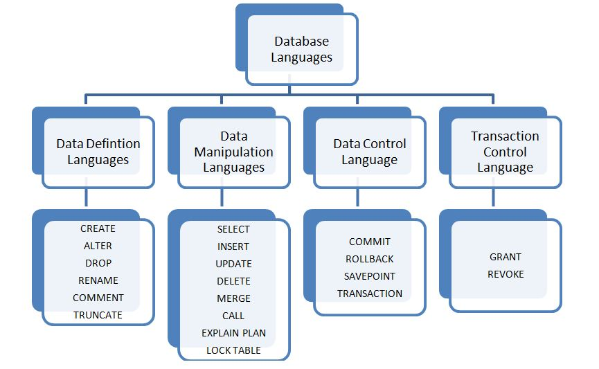
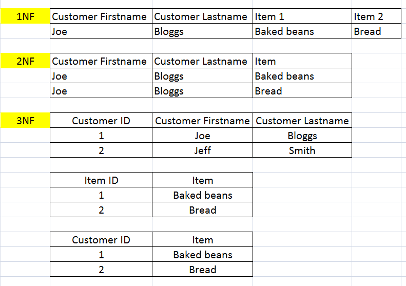
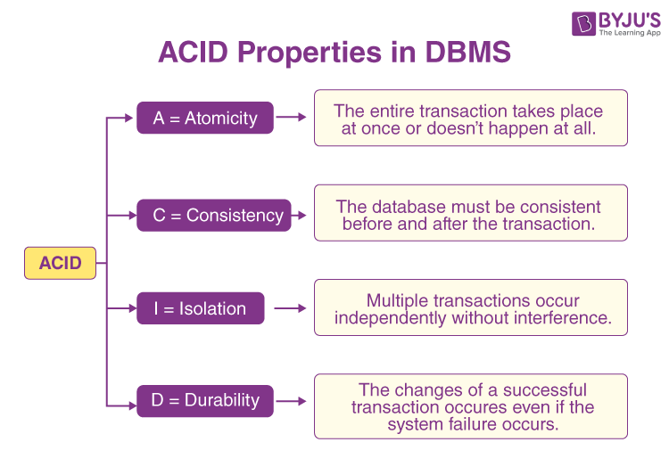

# Basic Database Concepts

*Following are some of the important database concepts.*

### 1. What is DBMS?
DBMS stands for Database Management System. It is a software system that enables users to efficiently store, manage, organize, retrieve, and manipulate large amounts of data. A DBMS provides an interface for users and applications to interact with databases without needing to understand the complexities of how the data is stored or managed at the physical level.

Key features of a DBMS include:

* Data Storage: The DBMS manages the physical storage of data on disk or other storage devices. It handles the organization of data to optimize storage and retrieval efficiency.

* Data Retrieval: Users can query the database to retrieve specific information using structured query languages like SQL (Structured Query Language).

* Data Manipulation: DBMS allows users to insert, update, and delete data in the database, ensuring data integrity and consistency.

* Data Security: DBMS provides access control mechanisms to restrict unauthorized access to data and ensure data security.

* Concurrency Control: In multi-user environments, DBMS manages concurrent access to the database to prevent conflicts and ensure data consistency.

* Data Integrity: DBMS enforces rules and constraints on data to maintain its accuracy and reliability.

* Backup and Recovery: DBMS provides mechanisms to create backups of data and recover from failures or data corruption.

* Data Abstraction: Users interact with the database using a high-level language, abstracted from the complexities of data storage and retrieval.

* Transaction Management: DBMS supports the concept of transactions, ensuring that a sequence of database operations is treated as a single unit of work with properties like Atomicity, Consistency, Isolation, and Durability (ACID).

* Scalability and Performance: DBMS is designed to handle large datasets and provide efficient data access and manipulation.

There are different types of DBMS, including relational databases, NoSQL databases, object-oriented databases, and more. Each type caters to different data models and use cases. The choice of a DBMS depends on factors like the nature of the data, the scale of operations, and the specific requirements of the application.

----------------------------------------------

### 2. What is Database?
A database is a structured collection of data that is organized, stored, and managed in a way that allows efficient access, retrieval, manipulation, and maintenance of data. It serves as a repository for storing various types of information, ranging from simple text entries to complex multimedia content. Databases are used to store data for a wide range of applications, including business, scientific research, education, e-commerce, social networking, and more.
There are two types of databases, Relational and Non-Relational Databases. 

### Relational Database:
Relational databases are a type of database management system that stores and manages data in a structured manner, using tables with rows and columns. These databases are based on the relational model, which was introduced by E.F. Codd in the 1970s. The data in relational databases is organized into tables, where each table represents a specific entity (e.g., customers, orders) and each row represents an instance of that entity. The columns in the table represent attributes or properties of the entity.

Key characteristics of relational databases include:

* Tabular Structure: Data is stored in tables with predefined schemas, where each column has a specific data type and each row represents a record.

* Data Integrity: Relational databases enforce data integrity through constraints, ensuring that data remains accurate and consistent.

* SQL (Structured Query Language): Relational databases use SQL for querying and manipulating data. SQL provides a standardized way to interact with the database.

* ACID Transactions: Relational databases follow the ACID properties to ensure data consistency in transactions.

* Data Relationships: Relationships between tables can be established through keys (primary keys and foreign keys), allowing data to be connected and queried across multiple tables.

* Scalability: While they can scale vertically (adding more resources to a single server), horizontal scalability can be more challenging due to the rigid structure.

* Structured Data: Best suited for applications with well-defined data schemas and complex queries.

Common examples of relational databases include MySQL, PostgreSQL, Oracle Database, Microsoft SQL Server, and SQLite.

### Non-Relational Database (NoSQL Databases):
Non-relational databases, often referred to as NoSQL databases, are a category of databases that diverge from the traditional tabular, structured approach of relational databases. These databases are designed to handle large volumes of unstructured or semi-structured data and offer flexible data models.

Key characteristics of NoSQL databases include:

* Flexible Data Models: NoSQL databases support various data models, including key-value, document, column-family, and graph. This flexibility is useful for accommodating different types of data.

* Scalability: NoSQL databases are well-suited for horizontal scalability, making them a good choice for applications with high volumes of data and traffic.

* Schema Flexibility: NoSQL databases allow for dynamic changes to the data schema, making it easier to adapt to evolving application requirements.

* Performance: NoSQL databases are designed for high-speed data retrieval and can handle large amounts of data efficiently.

* Eventual Consistency: Some NoSQL databases prioritize availability and partition tolerance over strict consistency, leading to the concept of eventual consistency.

* Distributed Architecture: NoSQL databases are often built to be distributed across multiple nodes or servers.

* Unstructured and Semi-Structured Data: Ideal for applications involving diverse data types and rapidly changing data structures.

Common examples of NoSQL databases include MongoDB (document store), Cassandra (column-family store), Redis (key-value store), and Neo4j (graph database).

----------------------------------------------

### 3. What is RDBMS?
RDBMS stands for Relational Database Management System. It's a specialized software system designed to manage and maintain relational databases. Relational databases are structured using a tabular format, where data is stored in tables consisting of rows and columns. An RDBMS provides a framework for creating, querying, updating, and managing these tables.

Key features of an RDBMS include:

* Tabular Structure: Data is organized into tables, with each table containing rows (records) and columns (fields). Each column has a defined data type.

* Data Integrity: RDBMS enforces data integrity by allowing the definition of constraints, such as primary keys, foreign keys, and unique constraints. These ensure the accuracy and consistency of the data.

* SQL (Structured Query Language): RDBMS systems use SQL to interact with databases. SQL provides a standardized way to create, manipulate, and query data.

* ACID Transactions: RDBMS systems follow the ACID properties (Atomicity, Consistency, Isolation, Durability) to ensure data consistency and integrity in transactions.

* Data Relationships: RDBMS systems allow the establishment of relationships between tables through primary and foreign keys. This facilitates complex querying across related tables.

* Normalization: RDBMS systems encourage normalization, which is the process of designing the database to minimize data redundancy and improve efficiency.

* Structured Data: Best suited for applications where data follows a predefined structure and relationships need to be maintained.

* Joins: RDBMS systems enable the use of joins to combine data from multiple tables, allowing complex queries to be executed.

* Scalability: RDBMS systems can be scaled vertically (adding more resources to a single server), but horizontal scalability might require more planning due to the structured nature of data.

Common examples of RDBMS systems include MySQL, PostgreSQL, Oracle Database, Microsoft SQL Server, and SQLite. These systems are widely used in various applications such as enterprise software, e-commerce platforms, content management systems, and more.

It's important to note that while all RDBMS systems are relational databases, not all relational databases are RDBMS systems. The term "RDBMS" specifically refers to the software that manages and provides tools for working with relational databases according to the principles of the relational model.

----------------------------------------------

### 4. What are Database Languages? DDL? DML? DCL? TCL?
Database languages are specialized languages used to interact with and manipulate databases. These languages provide different sets of commands and statements for various purposes, such as defining the structure of the database, manipulating data, managing access, and controlling transactions. There are four main types of database languages: DDL, DML, DCL, and TCL.

### DDL (Data Definition Language):
DDL is used to define the structure of the database schema. It includes commands for creating, altering, and dropping database objects like tables, indexes, and views. DDL statements are used to specify the logical organization of data within the database.

**Common DDL commands include:**

* CREATE TABLE: Creates a new table with specified columns and data types.
* ALTER TABLE: Modifies the structure of an existing table (e.g., adding or dropping columns).
* DROP TABLE: Removes a table and its associated data from the database.
* CREATE INDEX: Creates an index on one or more columns for faster data retrieval.

### DML (Data Manipulation Language):
DML is used to manipulate data stored in the database. It includes commands for inserting, updating, and deleting data in the database tables. DML statements allow users to interact with the data itself.

Common DML commands include:

* INSERT: Adds new records into a table.
* UPDATE: Modifies existing data in a table.
* DELETE: Removes data from a table.
* SELECT: Retrieves data from one or more tables based on specified criteria.

### DCL (Data Control Language):
DCL is used to control access to the database and manage user privileges. DCL statements define who can access the database, perform specific operations, and manipulate the data.

Common DCL commands include:

* GRANT: Provides specific privileges (e.g., SELECT, INSERT) to users or roles.
* REVOKE: Removes previously granted privileges from users or roles.

### TCL (Transaction Control Language):
TCL is used to manage transactions within the database. A transaction is a sequence of database operations that are treated as a single unit of work. TCL statements help maintain the integrity of the data during transactions.

**Common TCL commands include:**

* COMMIT: Saves changes made during a transaction to the database.
* ROLLBACK: Undoes changes made during a transaction and restores the database to its previous state.
* SAVEPOINT: Sets a point within a transaction to which you can later roll back.
* SET TRANSACTION: Defines characteristics of a transaction (e.g., isolation level).

----------------------------------------------

### 5. What is Normalization (1NF ,2NF,3NF)?

Normalization is a process in database design that involves structuring a relational database schema to reduce data redundancy and improve data integrity. The goal of normalization is to eliminate anomalies in data storage and ensure that each piece of data is stored in a way that minimizes redundancy and maintains logical consistency.

The process of normalization is typically carried out using a set of rules and guidelines known as normal forms. There are several normal forms, each representing a specific level of data normalization. The most common normal forms are:

### First Normal Form (1NF):
Eliminates duplicate columns in a table by ensuring that each column contains only atomic (indivisible) values.
Each column should contain a single piece of data, and each row should be unique.

### Second Normal Form (2NF):
Builds on 1NF by ensuring that non-key attributes (attributes that are not part of the primary key) are fully functionally dependent on the entire primary key.
If an attribute is only dependent on part of the primary key, it is moved to a separate table.

### Third Normal Form (3NF):
Builds on 2NF by ensuring that all attributes in a table are functionally dependent only on the primary key (not on other non-key attributes).
Transitive dependencies are eliminated by creating separate tables for attributes that depend on other non-key attributes.

Higher levels of normalization exist beyond 3NF, including Boyce-Codd Normal Form (BCNF) and Fourth Normal Form (4NF), each addressing more complex issues of data redundancy and dependency.

Normalization helps achieve several benefits:

* Reduced Data Redundancy: By eliminating duplicate data, the amount of storage required is minimized, and updates only need to be made in one place.

* Improved Data Integrity: Normalized databases are less prone to data anomalies (insertion, update, deletion anomalies) because data is stored in a more logical and organized manner.

* Easier Maintenance: Changes to the database structure or data are easier to implement without risking data inconsistencies.

----------------------------------------------

### 6. what is DeNormalization?
Denormalization is a database design technique that involves intentionally introducing redundancy into a database schema. Unlike normalization, which aims to reduce redundancy and improve data integrity, denormalization intentionally duplicates data in order to optimize query performance and improve certain aspects of database performance.

In denormalization, the primary goal is often to enhance read operations at the expense of potentially increasing the complexity of write operations and introducing the risk of data anomalies. By storing redundant data, complex joins and multiple table lookups can be avoided, leading to faster query execution. Denormalization is particularly useful in scenarios where read-heavy workloads are prevalent and quick data retrieval is crucial.

Here are a few common reasons to consider denormalization:

* Performance Improvement: By reducing the need for complex joins and multiple table scans, denormalized databases can lead to faster query execution times. This is especially beneficial for reporting, data warehousing, and analytical applications.

* Reduced Complexity: Denormalization can simplify query writing and maintenance by minimizing the need for joins across multiple tables.

* Aggregation Efficiency: When dealing with large datasets, denormalization can make aggregation operations (like SUM, AVG, COUNT) more efficient.

* Read-Intensive Workloads: Applications that primarily involve reading data, such as business intelligence tools, benefit from denormalization as it accelerates data retrieval.

Denormalization should be employed thoughtfully and strategically, taking into account the specific use case, the types of queries the database will face, the size of the dataset, and the overall performance goals. It's also worth noting that some modern database systems and technologies offer features like indexing, caching, and materialized views that can enhance query performance without resorting to full denormalization.

----------------------------------------------

### 7. What is join?
A join is an operation that combines rows from two or more tables based on a related column between them. The primary purpose of a join is to retrieve data that is spread across multiple tables and create a unified result set that combines information from these tables.

Joins are a fundamental concept in relational databases and are used to gather data from related tables to answer more complex questions or to combine data in meaningful ways. The columns used for joining tables are typically primary and foreign keys, which establish relationships between the tables.

There are several types of joins commonly used in database queries:

* Inner Join:
An inner join returns only the rows that have matching values in both the joined tables. If a row in one table does not have a corresponding match in the other table, that row will be excluded from the result.

* Left Join (Left Outer Join):
A left join returns all the rows from the left (or first) table and the matching rows from the right (or second) table. If there is no match for a row in the left table, the result will contain null values for columns from the right table.

* Right Join (Right Outer Join):
A right join is similar to a left join but returns all the rows from the right table and the matching rows from the left table. Rows from the right table without a match in the left table will have null values for left table columns.

* Full Outer Join:
A full outer join returns all rows from both tables, including matching rows and rows that do not have a match in either table. If there is no match for a row in either table, the result will contain null values for the columns from the table without a match.

* Self Join:
A self join is a join in which a table is joined with itself. It is often used to find relationships within the same table, such as when dealing with hierarchical data.

----------------------------------------------

### 8. What is Atomicity?
Atomicity is one of the fundamental properties in database management systems (DBMS) that ensures the integrity of transactions. It is often referred to as one of the ACID properties, where ACID stands for Atomicity, Consistency, Isolation, and Durability. These properties are critical for maintaining data reliability and consistency, especially in multi-user and concurrent database environments.

Atomicity specifically refers to the concept that a transaction is treated as a single, indivisible unit of work. It implies that either all the operations within a transaction are successfully completed and committed to the database, or none of them are. In other words, a transaction is atomic if it's all or nothing.

Here are the key aspects of atomicity:

* Success or Failure: If a transaction executes successfully and completes all its operations, it's considered successful. However, if any part of the transaction fails (such as an error or a violation of constraints), none of the changes made by that transaction are applied to the database.

* Rollback: If a transaction fails partway through its execution, the system must roll back (undo) all the changes made by that transaction up to that point. This ensures that the database remains in a consistent state and doesn't get left in an undefined or inconsistent state due to a failed transaction.

* Undo Log: DBMSs often use techniques like undo logs to maintain a record of the changes made during a transaction. If a transaction needs to be rolled back, the undo log is used to reverse the changes made by the transaction.

Atomicity is crucial to maintain data integrity and consistency, especially in scenarios where multiple transactions are being executed concurrently. Without atomicity, the database could end up in a state where some transactions have partially completed, leading to data corruption or inconsistencies.

----------------------------------------------

### 9. What is ACID?
ACID is an acronym that represents a set of properties or characteristics that ensure the reliability and consistency of transactions in a database management system (DBMS). These properties are essential for maintaining data integrity, especially in multi-user and concurrent database environments. The ACID properties are:

* **Atomicity:**

  Atomicity ensures that a transaction is treated as a single, indivisible unit of work. Either all the operations within a transaction are successfully completed and committed to the database, or none of them are. If a transaction fails at any point, all changes made by that transaction are rolled back, and the database remains in a consistent state.

* **Consistency:**

  Consistency ensures that a transaction takes the database from one consistent state to another. Transactions should adhere to defined rules and constraints, maintaining the integrity of the data. If a transaction violates any integrity constraints, the entire transaction is aborted, and the database is left unchanged.

* **Isolation:**

  Isolation ensures that the operations of one transaction are isolated from the operations of other concurrent transactions. This prevents interference between transactions and ensures that they do not see each other's intermediate states. Transactions should execute as if they were the only ones running, even in a multi-user environment.

* **Durability:**
  
  Durability guarantees that once a transaction is committed, its changes are permanent and will survive any subsequent system failures, crashes, or power outages. Committed data is stored in a way that it can be recovered and reconstructed even after an unexpected failure.

These ACID properties are crucial for maintaining data integrity and consistency in databases. They provide the foundation for building reliable systems that can handle concurrent user access and ensure that the data remains accurate and reliable, even in the presence of system failures.

----------------------------------------------

### 10. What is SSD?
SSD stands for "Solid State Drive." It is a type of data storage device that uses NAND-based flash memory to store data. Unlike traditional Hard Disk Drives (HDDs), which use spinning disks to read and write data, SSDs have no moving parts, making them faster, more durable, and more energy-efficient.

The key advantages of SSDs include:

* Speed: SSDs are significantly faster than HDDs in terms of both read and write speeds. This leads to faster boot times, quicker application launches, and improved overall system responsiveness.

* Durability: Since SSDs have no mechanical components that can wear out over time, they are more resistant to shocks, vibrations, and physical impacts. This makes them ideal for laptops and portable devices.

* Energy Efficiency: SSDs consume less power than traditional HDDs because they don't require motors to spin disks. This can lead to longer battery life in laptops and reduced power consumption in desktop systems.

* Compact Form Factor: SSDs are available in smaller form factors than traditional HDDs, which allows for more flexible design options in devices like ultra-thin laptops and compact desktops.

* No Noise: Because SSDs lack moving parts, they are completely silent in operation, in contrast to the spinning noise often associated with HDDs.

* Less Heat Generation: SSDs generate less heat during operation compared to HDDs, contributing to better temperature management in systems.

However, SSDs also tend to be more expensive per unit of storage compared to HDDs, which makes them less cost-effective for extremely large storage needs. Over time, the cost of SSDs has been decreasing, but HDDs still retain an edge in terms of cost-effectiveness for very high-capacity storage.

SSDs are commonly used as primary drives in laptops and desktop computers to improve system performance, as well as in other devices like smartphones, tablets, gaming consoles, and data centers where speed, durability, and energy efficiency are important factors.

----------------------------------------------

### 11. RAM vs SSD

**RAM (Random Access Memory):**

* Speed: RAM is much faster than SSDs. It provides the fastest access to data for the CPU. Data stored in RAM can be read and written to almost instantly.

* Temporary Storage: RAM is used as temporary working memory for the computer's active processes and applications. It holds the data that the CPU is actively using or processing.

* Multitasking: RAM allows for smooth multitasking. The more RAM a system has, the more applications and processes it can keep active without slowing down.

* Low Latency: RAM has very low latency, meaning that data can be accessed quickly without significant delays.

**SSD (Solid State Drive):**

* Storage Capacity: SSDs offer significantly larger storage capacity compared to RAM. They are used for storing the operating system, applications, files, and other data that need to be persistently stored.

* Non-Volatile Storage: SSDs retain data even when the computer is powered off. This makes them suitable for storing files and applications that you want to keep for the long term.

* Boot Time and Application Loading: While not as fast as RAM, SSDs are still much faster than traditional HDDs. They contribute to faster boot times and quicker application loading compared to HDDs.

* Cost: SSDs are more cost-effective in terms of storage capacity per dollar compared to RAM. This makes them suitable for storing large amounts of data.

----------------------------------------------

### 12. Speed of RAM and SSD?

**RAM Speed:**

RAM is extremely fast, with read and write speeds measured in nanoseconds (ns). This makes it ideal for providing the CPU with quick access to data that it's actively using.
Modern DDR4 RAM, which is common in many computers, typically has speeds that range from around 2133 MHz (megahertz) to over 4000 MHz. The higher the MHz value, the faster the RAM can transfer data.

**SSD Speed:**

SSDs are significantly faster than traditional Hard Disk Drives (HDDs) but are generally slower than RAM.
SSD speeds are measured in megabytes per second (MB/s) for sequential read and write operations. Sequential read speeds for SSDs can range from around 200 MB/s to over 5000 MB/s or more, depending on the specific SSD model.
Random read and write speeds, which measure how quickly the SSD can access and write small chunks of data, are also important. These speeds are usually measured in IOPS (input/output operations per second) and can range from a few thousand IOPS to hundreds of thousands, again depending on the SSD.

RAM provides the fastest data access times, allowing the CPU to quickly retrieve and modify data in active use.

SSDs are significantly slower than RAM but still much faster than traditional HDDs. They're used for storing and retrieving data that needs to be accessed more quickly than from an HDD.

In terms of overall system performance, having sufficient RAM is crucial for smooth multitasking and quick access to active data, while using an SSD for storage significantly improves boot times, application loading times, and overall system responsiveness compared to using an HDD.