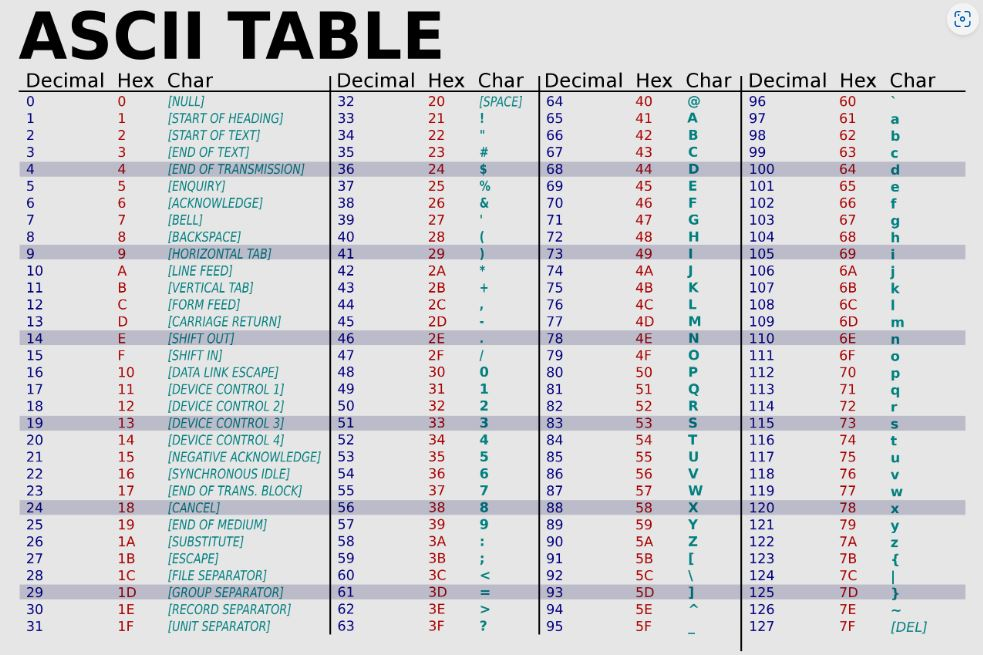
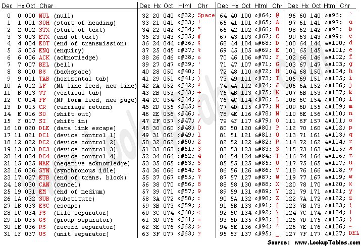
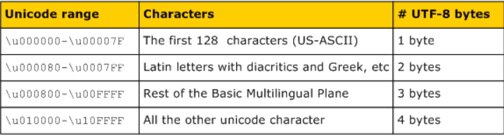
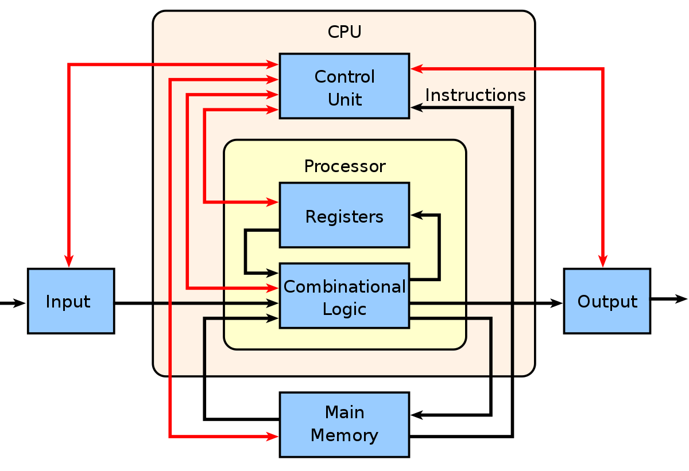
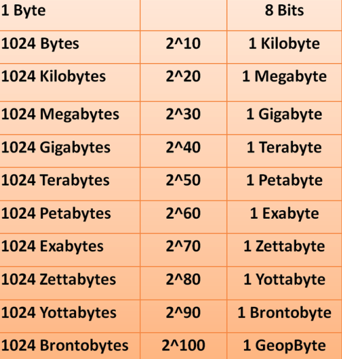
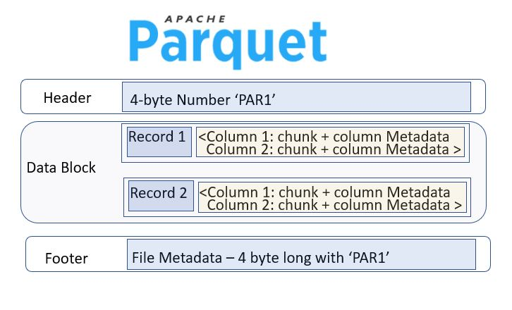
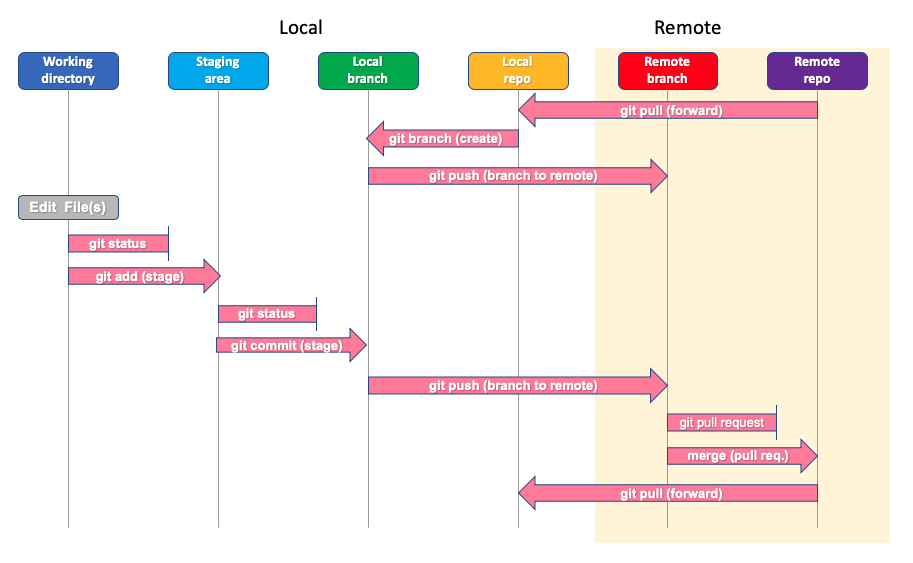

# General Programming Concepts

*Following are some of the important general programming concepts.*

### 1. What's ASCII?
ASCII (American Standard Code for Information Interchange) is a character encoding standard that assigns a unique 7-bit binary number to each alphanumeric character, punctuation mark, and control character used in English text. It was widely used in early computer systems and communication protocols.

Characters in ASCII encoding include upper and lowercase letters A through Z, numerals 0 through 9 and basic punctuation symbols. It also uses some non-printing control characters that were originally intended for use with teletype printing terminals.

ASCII characters may be represented in the following ways:

* as pairs of hexadecimal digits -- base-16 numbers, represented as 0 through 9 and A through F for the decimal values of 10-15;
* as three-digit octal (base 8) numbers;
* as decimal numbers from 0 to 127; or
* as 7-bit or 8-bit binary

Following is the ASCII Table: 

----------------------------------------------

### 2. What's Unicode?
Unicode is a universal character encoding standard that encompasses characters from all languages and scripts used worldwide. Unlike ASCII, which is limited to 128 characters, Unicode assigns a unique code point (a numeric value) to each character, allowing representation of a vast range of symbols, alphabets, and characters.

Unicode provides a unique number for every character including punctuation marks, mathematical symbols, technical symbols, arrows, and characters making up non-Latin alphabets such as Thai, Chinese, or Arabic script. Since its inception, Unicode has been adopted by all modern software providers, allowing the transportation of data through devices, applications, and platforms without corruption. It is now used in all major operating systems, browsers, search engines, laptops, smartphones, and across the internet.

Following is the UNICODE Table: 

----------------------------------------------

### 3. What's utf-8?
UTF-8 (Unicode Transformation Format - 8-bit) is a variable-width character encoding that's widely used on the internet and in computing. It can represent any Unicode character using one to four bytes. UTF-8 is backward-compatible with ASCII, meaning ASCII characters are represented as a single byte, while extended characters use multiple bytes.

Spatial efficiency is a key advantage of UTF-8 encoding. If instead every Unicode character was represented by four bytes, a text file written in English would be four times the size of the same file encoded with UTF-8.

Another benefit of UTF-8 encoding is its backward compatibility with ASCII. The first 128 characters in the Unicode library match those in the ASCII library, and UTF-8 translates these 128 Unicode characters into the same binary strings as ASCII. As a result, UTF-8 can take a text file formatted by ASCII and convert it to human-readable text without issue.

----------------------------------------------

### 4. How is text data stored on disk?
Text data is stored on disk as binary data using a character encoding like UTF-8. Each character is translated into its corresponding binary representation according to the chosen encoding. When reading the data, the encoding is used to interpret the binary values and convert them back into characters.

Here's a general overview of how text data is typically stored on disk:

* File Formats: Text data is usually stored in files, and these files can have different formats. Common text file formats include plain text files (with extensions like .txt), markup languages like HTML, XML, JSON, and more. These formats define how the data is structured and organized within the file.

* Character Encoding: Text data consists of characters, and these characters are represented as numbers in a computer's memory. Different character encoding schemes are used to map characters to their corresponding numeric values. The most common character encoding is UTF-8 (Unicode Transformation Format 8), which can represent a wide range of characters from various languages and symbol sets.

* ASCII: A basic character encoding that uses 7 bits to represent characters. It's limited to the English alphabet and some special characters.
UTF-8: A variable-width encoding that uses 8, 16, or 24 bits to represent characters. It's backward-compatible with ASCII and can represent a vast range of characters from different languages.

* Byte Representation: Text characters are ultimately stored as binary data on disk. Each character is represented by one or more bytes depending on the chosen character encoding. For example, in UTF-8, characters can take up one to four bytes, depending on their code points.

* Newline Characters: Different operating systems use different characters to represent newlines (line breaks) in text files. For example, Windows uses a carriage return followed by a line feed (\r\n), Unix-based systems use just a line feed (\n), and older Mac systems used only a carriage return (\r).

* Encoding Metadata: In some cases, the character encoding used for a text file might be specified in the file itself or indicated by metadata associated with the file. This information helps software interpret the data correctly.

* Byte Order Mark (BOM): In Unicode-based encodings like UTF-16 and UTF-32, a special character known as the Byte Order Mark (BOM) may be used to indicate the byte order (endianness) of the file.

When reading or writing text data to and from disk, it's important to handle the character encoding correctly to ensure that the data is interpreted and displayed as intended. Different programming languages and libraries provide functions and classes to handle these encoding and decoding operations, abstracting away the low-level details for developers.

----------------------------------------------

### 5. Explain Modern Hardware Architecture
Modern hardware architecture involves a CPU with multiple cores, fast RAM, various types of storage (SSD, HDD), and peripherals connected through buses. The CPU executes instructions, cores allow parallel processing, RAM holds data for active tasks, and storage retains persistent data. Buses enable communication between components.

* Central Processing Unit (CPU): The CPU is the "brain" of the computer and performs most of the actual computation. It consists of multiple cores, each capable of executing instructions independently. Modern CPUs incorporate advanced features like pipelining, out-of-order execution, and multiple levels of cache memory to optimize performance.

* Memory Hierarchy:

  * Cache Memory: CPUs use cache memory to store frequently used data and instructions for faster access. There are multiple levels of cache (L1, L2, L3) with varying sizes and speeds. 
  * Main Memory (RAM): Random Access Memory (RAM) stores data that the CPU is currently working on. It provides faster access than storage devices but is volatile, meaning its contents are lost when the power is turned off.

* Storage Devices:

  * Solid State Drives (SSDs): These use NAND-based flash memory and provide faster read/write speeds compared to traditional hard disk drives (HDDs).
  * Hard Disk Drives (HDDs): These use rotating disks and magnetic heads to read and write data. They are slower than SSDs but offer higher storage capacity at a lower cost.

* Input/Output (I/O) Devices:

  * Graphics Processing Unit (GPU): While originally designed for rendering graphics, modern GPUs are used for parallel processing in tasks like machine learning, scientific simulations, and more.
  * Network Interface Cards (NICs): These enable communication between computers over networks.
  * Peripherals: Devices like keyboards, mice, printers, and external storage devices are connected through various I/O interfaces.

* Bus Architecture: Buses are communication pathways that allow data to move between different components. Modern computers use high-speed buses like the PCI Express (PCIe) for connecting components such as GPUs, SSDs, and expansion cards.

* Instruction Set Architecture (ISA): This is the interface between the software and hardware, defining the instructions that the CPU can execute. Common ISAs include x86, ARM, and RISC-V.

* Multicore and Parallel Processing: Modern CPUs often have multiple cores, allowing for concurrent execution of instructions. Parallel processing techniques are employed to divide tasks into smaller subtasks that can be executed simultaneously, improving overall performance.

* Virtualization and Cloud Computing: Hardware virtualization allows multiple operating systems or instances to run on a single physical machine. Cloud computing takes advantage of virtualization to provide on-demand access to computing resources over the internet.

* Power Efficiency and Cooling: As hardware becomes more powerful, managing power consumption and heat generation becomes critical. Energy-efficient designs and advanced cooling solutions are used to prevent overheating.

* Security Features: Modern hardware architecture incorporates security features like hardware-level encryption, secure boot, and trusted platform modules to protect against unauthorized access and data breaches.

* System-on-Chip (SoC): Many devices, including smartphones and embedded systems, use System-on-Chip designs where multiple components (CPU, GPU, memory, I/O) are integrated onto a single chip.

* Quantum Computing (Emerging): While not yet mainstream, quantum computing is an emerging technology that leverages quantum bits (qubits) to perform complex computations much faster than classical computers for specific types of problems.

Modern hardware architecture is characterized by its focus on performance optimization, energy efficiency, and the integration of multiple components to create powerful computing systems.

Below is the Modern Hardware Architecture shown : 

----------------------------------------------

### 6. What's the max RAM in 32-bit and 64 bit? and why?
A 32-bit system can theoretically address up to 4 GB of RAM because memory addresses are 32 bits wide. A 64-bit system can address much more memory (terabytes or more) due to its larger memory address space, which enhances performance and supports memory-intensive applications.

* 32-bit Systems:
   In a 32-bit system, the processor can generate 2^32 (4,294,967,296) unique memory addresses. This theoretically allows for addressing up to 4 GB (gigabytes) of memory. However, due to memory-mapped I/O and other system-related uses of memory addresses, the actual usable memory for applications is usually limited to around 3 to 3.5 GB, depending on the specific operating system and hardware configuration.

* 64-bit Systems:
   In a 64-bit system, the processor can generate 2^64 (18,446,744,073,709,551,616) unique memory addresses. This provides an astronomical theoretical limit of 18.4 million TB (terabytes) of addressable memory. This large address space is far beyond what is currently practical or affordable in consumer systems. However, 64-bit systems can effectively utilize much more RAM than 32-bit systems. Common operating systems like Windows, macOS, and Linux are capable of supporting several terabytes of RAM on modern hardware.

The reason 64-bit systems can address significantly more memory than 32-bit systems lies in the increased size of memory addresses. A 64-bit memory address can represent a much larger range of memory locations compared to a 32-bit address. This increase in address space allows for larger amounts of RAM to be used by applications and the operating system.

----------------------------------------------

### 7. How many bits in a byte
There are 8 bits in a byte. A bit, short for "binary digit," is the smallest unit of digital data and can have a value of either 0 or 1. A byte is a grouping of 8 bits, and it is the basic unit of storage in most computer systems. Bytes are used to represent characters, numbers, and other data in computing. For example, a byte can represent a single ASCII character, a small integer, or a piece of data.

Below is the byte conversion table shown :

----------------------------------------------

### 8. Write decimal 0-7 in binary
* 0: 000
* 1: 001
* 2: 010
* 3: 011
* 4: 100
* 5: 101
* 6: 110
* 7: 111

----------------------------------------------

### 9. Convert decimal to binary

To convert numbers from decimal to binary, the given decimal number is divided repeatedly by 2 and the remainders are noted down till we get 0 as the final quotient. The following steps is considered as the decimal to binary formula that shows the procedure of conversion.

* Step 1: Divide the given decimal number by 2 and note down the remainder.
* Step 2: Now, divide the obtained quotient by 2, and note the remainder again.
* Step 3: Repeat the above steps until you get 0 as the quotient.
* Step 4: Now, write the remainders in such a way that the last remainder is written first, followed by the rest in the reverse order.
* Step 5: This can also be understood in another way which states that the Least Significant Bit (LSB) of the binary number is at the top and the Most Significant Bit (MSB) is at the bottom. This number is the binary value of the given decimal number.

----------------------------------------------

### 10. What is hex?
Hexadecimal (hex) is a base-16 numbering system using digits 0-9 and letters A-F. It's used to represent binary data more compactly and is often used in low-level programming and memory addressing.

Hexadecimal is often used in various computing contexts:

* Memory Addresses: Memory addresses in computer systems are often represented in hexadecimal. This is because each hexadecimal digit directly corresponds to 4 bits, which aligns well with the typical architecture of computers.

* Color Representation: In computer graphics and web design, colors are often represented using hexadecimal values for their Red, Green, and Blue (RGB) components. For example, the color white is represented as #FFFFFF.

* Programming and Debugging: Hexadecimal is used in programming and debugging to represent binary data, memory contents, and machine code instructions in a more compact and manageable form.

* Character Encoding: Unicode and ASCII character codes can be represented in hexadecimal to make it easier to work with and reference specific characters.

* Network Addresses: IP addresses in IPv6 are represented using hexadecimal notation

----------------------------------------------

### 11. What is JSON?
JSON (JavaScript Object Notation) is a lightweight data interchange format. It uses human-readable text to represent data objects consisting of attribute-value pairs. It's commonly used for APIs and configuration files.

JSON is designed to be easy for humans to read and write, and it's also easy for machines to parse and generate. It is often used as a data format in web applications, APIs (Application Programming Interfaces), and configuration files. JSON is particularly popular in web development because it's a natural fit for JavaScript, but it's used across a wide range of programming languages.

JSON data is represented as a collection of key-value pairs, where each key is a string and each value can be a string, number, boolean, object, array, or even null.

Here is an example of JSON format: 
    
    `{
       "name": "John Doe",
       "age": 30,
       "hobbies": ["reading", "swimming", "hiking"]
      }`

----------------------------------------------

### 12. What is XML? What is root, element, attributes, and text?
XML stands for "eXtensible Markup Language." It is a markup language that is used to store and transport structured data. Like HTML, XML uses tags to define elements within a document, but unlike HTML, XML is not concerned with how the data should be displayed. Instead, XML focuses on describing the structure and meaning of the data itself.

Here are some key concepts in XML:

* Root: The root element is the outermost element in an XML document. It encloses all other elements and serves as the starting point for the hierarchy of elements in the document.

* Element: An element is a fundamental building block of XML documents. Elements are enclosed within start tags (<element>) and end tags (</element>). Elements can contain other elements, text, or both. Elements can also have attributes.

* Attributes: Attributes are additional information associated with an element. They are specified within the start tag of an element and consist of a name and a value. Attributes provide extra metadata about an element.

* Text: Text refers to the content enclosed within an element. This can include plain text, numbers, or other data that the element represents. Text content is placed between the start and end tags of an element.

----------------------------------------------

### 13. What is CSV? What is header? how does escape work?
CSV stands for "Comma-Separated Values." It is a simple and widely used file format for storing tabular data, such as spreadsheets and databases. In a CSV file, each line typically represents a row of data, and the values within each row are separated by commas. CSV files are plain text files and can be easily opened and edited in various applications, including text editors and spreadsheet software. Special characters within values are escaped using techniques like enclosing in double quotes.

* Header: The header in a CSV file is the first row that contains the column names. It provides a clear label for each column, making it easier to understand the content of the data. Headers are not mandatory in CSV files, but they are common and help users understand the meaning of the data.

* Escape Characters: CSV files use specific rules for handling special cases like including commas or line breaks within the data values themselves. If a value contains a comma or a line break, it needs to be properly escaped to ensure that it doesn't interfere with the CSV structure.

----------------------------------------------

### 14. What is Parquet?
Parquet is an open-source columnar storage file format that is commonly used in big data processing and analytics environments. It is designed to store and manage structured data in a highly efficient and optimized way. Parquet was developed as part of the Apache Arrow project and is widely used in the Hadoop ecosystem, particularly with tools like Apache Spark, Apache Hive, and Apache Impala.

Key features of the Parquet file format include:

* Columnar Storage: Unlike traditional row-based storage formats, Parquet stores data in a columnar format. This means that values of the same column are stored together, allowing for better compression and more efficient query processing. This columnar design is particularly well-suited for analytics workloads, where queries often involve reading a subset of columns.

* Compression: Parquet employs advanced compression techniques to reduce the storage footprint of data. By storing similar values together and using efficient compression algorithms, Parquet can achieve substantial storage savings compared to row-based formats.

* Predicate Pushdown: Many query engines can take advantage of predicate pushdown with Parquet files. This means that query filters are applied to the metadata of the Parquet file before reading the actual data, minimizing the amount of unnecessary data read from disk.

* Schema Evolution: Parquet supports schema evolution, allowing you to modify the schema of your data over time without needing to rewrite or convert existing files. This flexibility is valuable in scenarios where data structures evolve and change.

* Cross-Platform Compatibility: Parquet files can be read and written by various programming languages and big data frameworks. This makes it suitable for heterogeneous environments where different tools need to access and process the same data.

* Data Type Support: Parquet supports a wide range of data types, including primitive types (integers, floats, strings, etc.), complex types (arrays, maps, structs), and user-defined types.

* Performance: The columnar storage format of Parquet enhances query performance, especially for analytical queries that involve aggregations, filtering, and projections.

Parquet files are commonly used in data warehousing, data lakes, and data processing pipelines where large volumes of structured data need to be stored and queried efficiently. The format's ability to balance storage efficiency with query performance makes it a popular choice in big data analytics scenarios.

----------------------------------------------

### 15. What is GIT? 
Git is a distributed version control system (VCS) that is widely used for tracking changes in source code during software development. It was created by Linus Torvalds in 2005 and has since become one of the most popular and powerful tools for managing codebase history, collaborating on software projects, and coordinating work among teams of developers.

Here are some key concepts and features of Git:

* Version Control System: Git allows developers to track changes to their codebase over time. It maintains a complete history of all changes, which helps developers understand when and why specific changes were made.

* Distributed: Unlike centralized version control systems, Git is distributed. Each developer has their own local copy of the entire repository, including the full history. This allows for offline work, faster operations, and resilience against server failures.

* Commits: In Git, a commit is a snapshot of the codebase at a particular point in time. It includes changes to files and a message explaining why the changes were made.

* Branches: Developers can create branches to work on new features, bug fixes, or experiments without affecting the main codebase. Branches allow for parallel development and isolation of changes.

* Merging and Pull Requests: Once changes in a branch are complete, they can be merged back into the main branch. Pull requests (or merge requests) provide a way for developers to propose changes for review before merging them.

* Remote Repositories: Git supports remote repositories, which can be hosted on platforms like GitHub, GitLab, or Bitbucket. These repositories serve as central hubs for sharing code and collaborating with others.

* Collaboration: Git facilitates collaboration among multiple developers by allowing them to work on different branches and merge their changes seamlessly.

* Staging Area: Git introduces a staging area (also called an index) that allows developers to select and prepare specific changes for commit, providing fine-grained control over what gets recorded in a commit.

* History Tracking: Git maintains a detailed history of changes, including who made each change, when it was made, and why. This history helps with debugging, auditing, and understanding the evolution of the codebase.

* Tags: Git allows developers to create tags to mark specific points in history, such as releases or milestones.

----------------------------------------------
### 16. Explain GIT flow with diagram (master/dev/feature/release/)
In the Git Flow branching model, several types of branches are used to manage the development, testing, and release processes. Each type of branch serves a specific purpose in organizing and structuring the workflow. Here's an explanation of the main branch types:

* **Master Branch:**
  The master branch is the primary branch that represents the production-ready codebase.
It contains the stable and tested version of the software.
Direct commits to the master branch are usually reserved for tagging new releases.
This branch is typically the starting point for creating other branches, such as release or hotfix branches.

* **Develop Branch:**
  The develop branch is an integration branch where most of the ongoing development work takes place.
It's used for features, bug fixes, and other development tasks.
Feature branches are merged into the develop branch once their development is complete and tested.
The develop branch should always be in a state where the code is ready for testing.

* **Feature Branches:**
  Feature branches are used for developing new features or enhancements.
Each feature is developed in its own isolated branch, typically branched off from develop.
Feature branches allow developers to work on features independently without disrupting ongoing development.
Once a feature is complete and tested, it is merged back into the develop branch.

* **Release Branches:**
  A release branch is created when the code in the develop branch is ready for release.
The purpose of the release branch is to prepare the code for deployment by performing final testing, bug fixes, and version number updates.
Any last-minute changes or improvements for the upcoming release are made in this branch.
Once the release is considered stable, it is merged into both master (for deployment) and develop.

* **Hotfix Branches:**
  Hotfix branches are used to address critical bugs or issues in the production code (master branch).
They allow for quick fixes to be developed and tested without disrupting ongoing development in the develop branch.
A hotfix branch is created from master, and the fix is implemented and tested.
Once the fix is validated, it's merged back into both master (for immediate deployment) and develop (to include the fix in future releases).

Each of these branch types serves a specific purpose in the software development and release cycle, helping to maintain a structured and organized workflow while enabling collaboration among developers and teams. The Git Flow branching model provides a clear way to manage feature development, releases, and hotfixes while ensuring code stability and efficient collaboration.

----------------------------------------------

### 17. What is PR (pull request)?
A Pull Request (PR) is a feature provided by version control platforms like GitHub, GitLab, and Bitbucket that enables developers to propose changes to a codebase and have those changes reviewed by others before merging them into the main branch. Pull Requests are a critical part of collaborative development and code quality control, particularly in team-based software projects.

Here's how the process of creating and using a Pull Request works:

* Creating a Pull Request:
  A developer works on a new feature, bug fix, or other code changes in a separate branch (often a feature branch) in a Git repository.
Once the developer believes the changes are ready for review and integration, they create a Pull Request.

* Details and Discussion:
  In the Pull Request, the developer provides details about the changes, including a description of what was done, why it was done, and any relevant context.
Other team members, reviewers, or collaborators are invited to review the changes.

* Review Process:
  Reviewers examine the code changes, provide feedback, ask questions, and suggest improvements.
Discussions can happen directly within the Pull Request's comments, allowing for a constructive feedback loop.

* Iterative Improvement:
  The developer can address feedback by making additional commits to the same branch, which are automatically added to the Pull Request.
Reviewers can see the new commits and continue the review process.

* Code Quality and Collaboration:
  Pull Requests allow multiple developers to collaborate on improving code quality before it's merged into the main branch.
The review process helps catch errors, improve code readability, and ensure adherence to coding standards.

* Merging:
  Once the changes have been reviewed and approved, they can be merged into the target branch (often the main or develop branch).
The merge can be done manually by the developer or using automated tools provided by the version control platform.

* Closing the Pull Request:
  After the changes are successfully merged, the Pull Request is closed. The related branch can be deleted if it's no longer needed.

Pull Requests provide a structured and controlled way for teams to collaborate on code changes, maintain code quality, and ensure that the main codebase remains stable. They also provide a clear history of discussions and decisions related to code changes, which can be valuable for future reference and accountability.

----------------------------------------------

### 18. Git pull/push/add/commit/checkout/branch/clone
 These are fundamental Git commands that we frequently use when working with version control. Here's an explanation of each command:
 
* **git pull:**
 git pull fetches changes from a remote repository and merges them into your current local branch. It's a combination of git fetch (to retrieve changes) and git merge (to integrate the changes).

* **git push:**
 git push is used to send your local changes to a remote repository. It updates the remote repository with your latest commits.

* **git add:**
 git add stages changes in your working directory to be committed. It prepares the changes for the next commit.

    For example, git add filename stages changes in the specified file for commit.

* **git commit:**
 git commit creates a snapshot of the staged changes and adds a commit message to describe the changes made in the commit.

    For example, git commit -m "Add new feature" commits the staged changes with the given message.

* **git checkout:**
 git checkout allows you to switch between branches or commits in your Git repository. You can also use it to create new branches.

    For example, git checkout branchname switches to the specified branch.

* **git branch:**
 git branch lists all the branches in your repository. It can also be used to create new branches.

    For example, git branch newbranch creates a new branch named "newbranch."

* **git clone:**
 git clone is used to create a copy of a remote repository on your local machine.

    For example, git clone https://github.com/username/repository.git clones the repository from GitHub.

----------------------------------------------

### 19. What is SSD?
SSD stands for "Solid State Drive." It is a type of data storage device that uses NAND-based flash memory to store data. Unlike traditional Hard Disk Drives (HDDs), which use spinning disks to read and write data, SSDs have no moving parts, making them faster, more durable, and more energy-efficient.

The key advantages of SSDs include:

* Speed: SSDs are significantly faster than HDDs in terms of both read and write speeds. This leads to faster boot times, quicker application launches, and improved overall system responsiveness.

* Durability: Since SSDs have no mechanical components that can wear out over time, they are more resistant to shocks, vibrations, and physical impacts. This makes them ideal for laptops and portable devices.

* Energy Efficiency: SSDs consume less power than traditional HDDs because they don't require motors to spin disks. This can lead to longer battery life in laptops and reduced power consumption in desktop systems.

* Compact Form Factor: SSDs are available in smaller form factors than traditional HDDs, which allows for more flexible design options in devices like ultra-thin laptops and compact desktops.

* No Noise: Because SSDs lack moving parts, they are completely silent in operation, in contrast to the spinning noise often associated with HDDs.

* Less Heat Generation: SSDs generate less heat during operation compared to HDDs, contributing to better temperature management in systems.

However, SSDs also tend to be more expensive per unit of storage compared to HDDs, which makes them less cost-effective for extremely large storage needs. Over time, the cost of SSDs has been decreasing, but HDDs still retain an edge in terms of cost-effectiveness for very high-capacity storage.

SSDs are commonly used as primary drives in laptops and desktop computers to improve system performance, as well as in other devices like smartphones, tablets, gaming consoles, and data centers where speed, durability, and energy efficiency are important factors.

----------------------------------------------

### 20. Compare RAM vs SSD

**RAM (Random Access Memory):**

* Speed: RAM is much faster than SSDs. It provides the fastest access to data for the CPU. Data stored in RAM can be read and written to almost instantly.

* Temporary Storage: RAM is used as temporary working memory for the computer's active processes and applications. It holds the data that the CPU is actively using or processing.

* Multitasking: RAM allows for smooth multitasking. The more RAM a system has, the more applications and processes it can keep active without slowing down.

* Low Latency: RAM has very low latency, meaning that data can be accessed quickly without significant delays.

**SSD (Solid State Drive):**

* Storage Capacity: SSDs offer significantly larger storage capacity compared to RAM. They are used for storing the operating system, applications, files, and other data that need to be persistently stored.

* Non-Volatile Storage: SSDs retain data even when the computer is powered off. This makes them suitable for storing files and applications that you want to keep for the long term.

* Boot Time and Application Loading: While not as fast as RAM, SSDs are still much faster than traditional HDDs. They contribute to faster boot times and quicker application loading compared to HDDs.

* Cost: SSDs are more cost-effective in terms of storage capacity per dollar compared to RAM. This makes them suitable for storing large amounts of data.

----------------------------------------------

### 21. Speed of RAM and SSD?

**RAM Speed:**

RAM is extremely fast, with read and write speeds measured in nanoseconds (ns). This makes it ideal for providing the CPU with quick access to data that it's actively using.
Modern DDR4 RAM, which is common in many computers, typically has speeds that range from around 2133 MHz (megahertz) to over 4000 MHz. The higher the MHz value, the faster the RAM can transfer data.

**SSD Speed:**

SSDs are significantly faster than traditional Hard Disk Drives (HDDs) but are generally slower than RAM.
SSD speeds are measured in megabytes per second (MB/s) for sequential read and write operations. Sequential read speeds for SSDs can range from around 200 MB/s to over 5000 MB/s or more, depending on the specific SSD model.
Random read and write speeds, which measure how quickly the SSD can access and write small chunks of data, are also important. These speeds are usually measured in IOPS (input/output operations per second) and can range from a few thousand IOPS to hundreds of thousands, again depending on the SSD.

RAM provides the fastest data access times, allowing the CPU to quickly retrieve and modify data in active use.

SSDs are significantly slower than RAM but still much faster than traditional HDDs. They're used for storing and retrieving data that needs to be accessed more quickly than from an HDD.

In terms of overall system performance, having sufficient RAM is crucial for smooth multitasking and quick access to active data, while using an SSD for storage significantly improves boot times, application loading times, and overall system responsiveness compared to using an HDD.

----------------------------------------------
