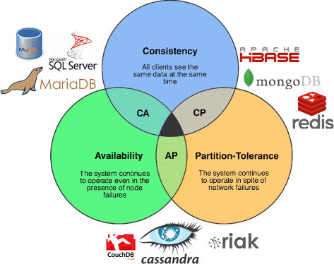

# Basic Hadoop Concepts

*Following are some of the important Hadoop concepts.*
                            
                                       
### 1. What is CAP theory?
CAP theory, also known as the CAP theorem, is a fundamental concept in distributed computing and database systems. It was formulated by computer scientist Eric Brewer in 2000 and is often used to describe the trade-offs that exist in designing and operating distributed systems.
 
The CAP theorem states that in a distributed system, you can have at most two out of the following three guarantees simultaneously:

1. Consistency (C): All nodes in the system see the same data at the same time. In other words, every read operation will return the most recent write.
 
2. Availability (A): Every request made to the system receives a response, without guaranteeing that it contains the most recent version of the data. In other words, the system remains operational and responsive to client requests.

3. Partition Tolerance (P): The system continues to function even in the presence of network partitions or communication failures between nodes. In a distributed system, network partitions can occur when some nodes are unable to communicate with others.

The CAP theorem implies that when a network partition occurs (P), you have to choose between maintaining consistency (C) or availability (A). In other words :

* If you prioritize Consistency and want all nodes to have the most recent data, you may have to sacrifice Availability during network partitions.

* If you prioritize Availability and want the system to remain responsive even in the presence of network partitions, you may have to sacrifice Consistency, meaning that different nodes may temporarily see different versions of the data.

It's important to note that the CAP theorem doesn't mean that distributed systems can only have two of these properties at all times. Instead, it highlights the trade-offs that must be made in designing and operating distributed systems, particularly in scenarios where network partitions are a possibility.  




 
The CAP theorem categorizes systems into three categories as shown in the image above: 

1. CA (Consistency and Availability)
    * The system prioritizes availability over consistency and can respond with possibly stale data.

    * Example databases: Cassandra, CouchDB, Riak, Voldemort.

2. AP (Availability and Partition Tolerance)
    * The system prioritizes availability over consistency and can respond with possibly stale data.
    * The system can be distributed across multiple nodes and is designed to operate reliably even in the face of network partitions.
    
    * Example databases: Amazon DynamoDB, Google Cloud Spanner.

3. CP (Consistency and Partition Tolerance)
    * The system prioritizes consistency over availability and responds with the latest updated data.
    * The system can be distributed across multiple nodes and is designed to operate reliably even in the face of network partitions.
           
    * Example databases: Apache HBase, MongoDB, Redis

 
---------------------------------------------- 

### 2. What is Hadoop?

Hadoop is an open-source framework for distributed storage and processing of large datasets. It was originally developed by Doug Cutting and Mike Cafarella and is now maintained by the Apache Software Foundation. Hadoop is designed to handle massive amounts of data and process it in a distributed and fault-tolerant manner. It has become a cornerstone technology for big data analytics and processing.

Key components of the Hadoop ecosystem include:

1. Hadoop Distributed File System (HDFS): HDFS is a distributed file system that stores data across multiple machines. It is designed to provide high-throughput access to data and to replicate data across nodes to ensure fault tolerance. HDFS is the storage layer of Hadoop.

2. MapReduce: MapReduce is a programming model and processing engine for distributed data processing. It allows developers to write programs that can process vast amounts of data in parallel across a Hadoop cluster. The MapReduce model consists of two main steps: a "Map" step for processing and filtering data and a "Reduce" step for aggregating and summarizing the results.

3. YARN (Yet Another Resource Negotiator): YARN is the resource management and job scheduling component of Hadoop. It enables multiple data processing frameworks, including MapReduce, to share and manage cluster resources efficiently. This flexibility allows Hadoop to support a variety of data processing workloads beyond MapReduce.

4. Hadoop Common: This includes libraries, utilities, and APIs that support the other components of the Hadoop ecosystem. It provides a set of common tools and utilities that are used by various Hadoop modules.

5. Hadoop Ecosystem Projects: Hadoop has a rich ecosystem of related projects and tools that extend its functionality. Some popular ones include Apache Hive (for SQL-like querying of data), Apache Pig (for data transformation and analysis), Apache HBase (a NoSQL database), Apache Spark (a fast, in-memory data processing engine), and Apache Kafka (a distributed messaging system), among many others.

Hadoop is known for its scalability, fault tolerance, and the ability to handle large volumes of data across clusters of commodity hardware. It has been widely adopted in industries such as finance, healthcare, retail, and more for tasks like log processing, data warehousing, and large-scale data analytics.


----------------------------------------------


### 3. Which Hadoop Distribution have you used?

----------------------------------------------

### 4. Which Hadoop version have you used?
----------------------------------------------


### 5. Have you created your own Hadoop cluster? and how?
----------------------------------------------

### 6. What are some Hadoop components?

Hadoop is a comprehensive ecosystem with various components and subprojects that work together to provide distributed storage and processing capabilities for big data. Here are some of the core components of the Hadoop ecosystem:

* Hadoop Distributed File System (HDFS): HDFS is the primary storage system in Hadoop. It is designed to store and manage large datasets by distributing them across a cluster of commodity hardware. HDFS ensures data reliability through data replication and fault tolerance.

* MapReduce: MapReduce is a programming model and processing framework for distributed data processing. It allows developers to write parallel processing jobs to analyze and manipulate data stored in HDFS. While MapReduce is one of the original components of Hadoop, other processing frameworks like Apache Spark have gained popularity for more advanced data processing tasks.

* YARN (Yet Another Resource Negotiator): YARN is the resource management and job scheduling component of Hadoop. It manages cluster resources and allows multiple data processing engines to coexist on the same Hadoop cluster. This flexibility enables the execution of various workloads, including MapReduce, Spark, and more.

* Hadoop Common: Hadoop Common includes libraries, utilities, and APIs that are used by other Hadoop components. It provides a common set of tools and resources for Hadoop ecosystem projects.

* Apache Hive: Hive is a data warehousing and SQL-like query language for Hadoop. It allows users to query and analyze data stored in HDFS using a familiar SQL syntax. Hive translates SQL queries into MapReduce or Tez jobs to perform data processing.

* Apache Pig: Pig is a high-level platform for creating data analysis programs. It provides a scripting language called Pig Latin, which abstracts the complexities of MapReduce programming. Pig is used for data transformation, ETL (Extract, Transform, Load) tasks, and data analysis.

* Apache HBase: HBase is a NoSQL, column-family database that runs on top of Hadoop. It provides real-time, random read/write access to large volumes of data and is suitable for use cases where low-latency data retrieval is essential.

* Apache Spark: While not originally part of the Hadoop ecosystem, Apache Spark has become an integral component for big data processing. It offers in-memory data processing, a rich set of libraries, and support for batch processing, stream processing, and machine learning. Spark can run on Hadoop YARN and HDFS or other storage systems.

* Apache Kafka: Kafka is a distributed messaging system used for real-time data streaming and event-driven architectures. It is often used in conjunction with Hadoop for ingesting and processing large volumes of data in real-time.

* Apache ZooKeeper: ZooKeeper is a distributed coordination service that helps manage and synchronize distributed applications. It is used for maintaining configuration information, providing distributed locks, and ensuring high availability of critical services in a Hadoop cluster.

* Ambari: Apache Ambari is a management and monitoring tool for Hadoop clusters. It simplifies cluster provisioning, configuration, and monitoring, making it easier to manage large Hadoop deployments.

These are just some of the core components of the Hadoop ecosystem. There are many other projects and tools within the Hadoop ecosystem, each designed to address specific needs and use cases in the world of big data processing and analytics. Organizations often choose and combine these components based on their requirements and data processing workflows.

----------------------------------------------

### 7. What is MapReduce?

MapReduce is a programming model and processing framework that was popularized by Google for processing and generating large datasets that can be distributed across a cluster of computers. It is designed to process vast amounts of data in parallel across a distributed computing infrastructure efficiently. 

MapReduce consists of two main phases: the Map phase and the Reduce phase.

* Map Phase: During the Map phase, the input data is divided into smaller chunks, and each chunk is processed independently by a set of worker nodes. Each worker node applies a user-defined function called the "mapper" to this data, generating a set of key-value pairs as intermediate outputs. This phase is responsible for breaking down the problem into smaller tasks and extracting relevant information.

* Shuffle and Sort: After the Map phase, the intermediate key-value pairs are sorted and grouped based on their keys. This step ensures that all values associated with a particular key are brought together and ready for the next phase.

* Reduce Phase: In the Reduce phase, another user-defined function called the "reducer" is applied to each group of intermediate key-value pairs. The reducer combines, aggregates, or analyzes the data based on the keys to produce the final output. This phase is responsible for summarizing and processing the data generated in the Map phase.

MapReduce is particularly well-suited for distributed data processing tasks because it can scale horizontally, allowing it to handle massive datasets by adding more processing nodes to the cluster. It also provides fault tolerance by replicating data across nodes, ensuring that even if a node fails, the data and processing can continue on other nodes.

Hadoop, an open-source framework, has popularized the MapReduce model and made it widely accessible for processing large-scale data in distributed computing environments. While the original MapReduce implementation focused on batch processing, various other frameworks and tools have been developed to address real-time and interactive data processing needs, making it a fundamental concept in the world of big data.

----------------------------------------------

### 8. Compare mapper and reducer

Mappers and reducers are two essential components in the MapReduce programming model and framework, used for distributed data processing. They have distinct roles and responsibilities within the MapReduce process. Here's a comparison of mappers and reducers:

1. **Mappers:**

    * Input Data Processing: Mappers are responsible for processing input data. They take in chunks of data from the input dataset and apply a user-defined function to each record within the chunk. This function transforms the input data into a set of intermediate key-value pairs.

    * Parallel Execution: Mappers operate in parallel. Each chunk of data can be processed independently by a separate mapper task running on different nodes in the cluster. This parallelism is a key feature of MapReduce, enabling efficient processing of large datasets.

    * Key-Value Pair Generation: Mappers produce intermediate key-value pairs. The keys are typically used for sorting and grouping in the shuffle and sort phase, while the values carry relevant data.

    * Data Distribution: Mappers are responsible for dividing the input data into smaller manageable pieces, distributing the processing load across multiple nodes. They help break down the problem into smaller tasks.

    * Filtering and Transformation: Mappers can perform filtering and data transformation tasks. They are responsible for extracting relevant information from the input data.

    * Example: In a word count application, mappers would take in a chunk of text and emit key-value pairs with words as keys and counts as values.

2. **Reducers:**

    * Intermediate Data Processing: Reducers receive the output of mappers, which consists of grouped and sorted intermediate key-value pairs. Their primary role is to process this data and generate the final output.

    * Aggregation and Analysis: Reducers perform aggregation, analysis, or any user-defined processing tasks on the data. They typically operate on a subset of the intermediate data for a specific key, which means they have access to all values associated with that key.

    * Sequential Execution: Reducers operate sequentially, one reducer per key-group. They are responsible for combining and summarizing the data for each key.

    * Output Generation: Reducers generate the final output, which is often the result of combining and processing the values associated with a specific key.

    * Example: In a word count application, reducers would receive the intermediate key-value pairs for each word and sum up the counts to produce the final count for that word.

In summary, mappers handle the initial processing of input data, breaking it down into key-value pairs, and operate in parallel to distribute the workload. Reducers take the intermediate data generated by mappers, perform further processing and aggregation, and produce the final output. Both mappers and reducers are essential components of the MapReduce framework and work together to enable distributed and scalable data processing.

----------------------------------------------

### 9. What does Mapreduce partitioner do?

In the MapReduce framework, a partitioner is a component responsible for determining which reducer will receive the intermediate key-value pairs produced by the mappers. It plays a crucial role in the distribution of data to reducer tasks, ensuring that related data is sent to the same reducer. The primary purpose of a partitioner is load balancing and optimizing the performance of the MapReduce job.

Here's how the MapReduce partitioner works:

* Mapping Phase: During the mapping phase of a MapReduce job, mappers generate intermediate key-value pairs. Each key is associated with a specific value or set of values.

* Shuffle and Sort Phase: After the mapping phase, the intermediate key-value pairs are sorted and grouped by their keys. This step is essential to bring together all values associated with a particular key.

* Partitioning: The partitioner takes the sorted and grouped key-value pairs and decides which reducer should receive each key. It uses a hashing or custom logic based on the key to make this determination. The goal is to evenly distribute the data across the reducer tasks to ensure that they have a similar amount of work to do.

* Reducer Assignment: Once the partitioner has assigned keys to reducers, the MapReduce framework sends the key-value pairs to their respective reducers for further processing. Each reducer is responsible for processing a subset of the data associated with specific keys.

* Parallel Processing: Reducers work in parallel, independently processing the data assigned to them. This parallelism is a key feature of MapReduce, as it allows for efficient processing of large datasets across multiple nodes in a distributed computing cluster.

The choice of a good partitioner function is essential for optimizing the performance of a MapReduce job. A well-designed partitioner ensures that the workload is evenly distributed among reducers, preventing data skew and reducing the chances of some reducers becoming bottlenecks.

By distributing the data effectively to reducers, the partitioner helps achieve load balancing, reduces data transfer overhead, and ensures efficient resource utilization in a MapReduce cluster. Different partitioning strategies can be employed based on the specific characteristics of the data and the use case to improve the overall performance of the MapReduce job.

----------------------------------------------

### 10. What's a combiner? Why?

A combiner, in the context of MapReduce and distributed data processing, is a function or mini-reducer that operates on the output of the mapper phase before the data is sent over the network to the reducer tasks. The primary purpose of a combiner is to perform local aggregation and reduction of data in order to minimize data transfer and improve the efficiency of a MapReduce job.

Here's why combiners are used and their key benefits:

* Reduction of Data Transfer: Combiners reduce the amount of data that needs to be transferred over the network from the mappers to the reducers. By aggregating and summarizing data locally on each mapper node, a combiner can significantly reduce the volume of intermediate key-value pairs that need to be transmitted. This reduces network congestion and speeds up data processing, especially in scenarios with limited bandwidth.

* Improved Performance: Combiners can lead to faster job execution because they reduce the amount of data that the reducer phase needs to process. Smaller data volumes are processed more efficiently, leading to quicker job completion times. This is especially beneficial in large-scale data processing tasks where data transfer can become a bottleneck.

* Lower Resource Usage: With combiners, the reducer tasks receive smaller input datasets, which results in reduced memory and processing requirements for reducers. This can lead to improved overall cluster resource utilization, allowing for more parallelism and accommodating larger MapReduce jobs on the same cluster.

* Reduced Disk I/O: Combiners can help minimize disk I/O, as they reduce the amount of intermediate data that is written to disk by the mappers and read by the reducers. This is beneficial for both local disk I/O and network I/O.

* Custom Aggregation: Combiners allow for custom aggregation and reduction logic tailored to the specific requirements of the MapReduce job. This means you can apply specific business logic to locally aggregate data on each mapper node.

It's important to note that while combiners can improve the efficiency and performance of a MapReduce job, they are not always applicable. They are most effective when the reduce operation is both commutative and associative (meaning the order of input data does not affect the result), as the output of the combiner may not be the same as the output of the reducer in all cases. Additionally, the use of combiners should not change the final result of the MapReduce job; they should only optimize the intermediate data transfer and processing.

----------------------------------------------

### 11. What is distcp?
distcp, short for Distributed Copy, is a command-line tool in the Hadoop ecosystem that is used for efficiently copying large volumes of data between Hadoop Distributed File System (HDFS) clusters or from HDFS to other file systems, such as local file systems or remote file systems. It's a valuable utility for tasks involving data migration, backup, replication, or synchronization within a Hadoop environment.

Here are some key features and use cases of distcp:

* Parallel Data Transfer: distcp is designed to perform parallel data transfers, which means it can copy data in parallel across multiple nodes or clusters, making it faster and more efficient for large-scale data copying.

* Preservation of File Attributes: distcp can preserve various file attributes, including permissions, timestamps, and ownership, during the copying process. This ensures that the copied data retains its original characteristics.

* Atomic Copy: distcp aims to provide an atomic copy operation, which means that if the copying process fails for any reason, it should not leave partially copied or inconsistent data in the destination. Either the copy operation succeeds in full, or it fails without affecting the existing data.

* Support for Different File Systems: While distcp is commonly used for copying data within HDFS clusters, it can also copy data to and from other file systems, such as Amazon S3, Azure Data Lake Storage, and Google Cloud Storage, using their respective connectors.

* Efficient Copying: distcp optimizes data copying by minimizing network traffic. It achieves this by only copying the differences (delta) between the source and destination files. This is particularly useful for incremental backups and data synchronization.

* Cross-Cluster Data Migration: It's often used when you need to move data from one Hadoop cluster to another, which could be located in a different geographical region or managed by a different organization.

* Data Replication: distcp can be used to replicate data across multiple HDFS clusters, enhancing data availability and fault tolerance.

Here's a basic example of using distcp to copy data from one HDFS location to another:

```
hadoop distcp hdfs://source-cluster/source-path hdfs://destination-cluster/destination-path
```

In this command, source-cluster and destination-cluster are the HDFS cluster URIs, and source-path and destination-path are the source and destination directories, respectively.

distcp is a versatile and powerful tool in the Hadoop ecosystem, allowing data engineers and administrators to efficiently manage and transfer large datasets across distributed environments.


----------------------------------------------

### 12. How distcp works?

distcp (Distributed Copy) in Hadoop is a tool used for efficiently copying large volumes of data between Hadoop Distributed File System (HDFS) clusters or within the same cluster. It operates in a parallel and distributed manner, which makes it suitable for handling big data scenarios. 

Here's an overview of how distcp works:

1. Distributed Execution: distcp leverages the distributed nature of Hadoop by running multiple map tasks in parallel. Each map task is responsible for copying a portion of the data.

2. Input and Output Paths: You specify the source and destination paths when you run distcp. These paths can point to directories, files, or even subsets of files within directories.

3. Path Expansion: distcp recursively expands the source path to include all the files and directories within it. It then creates a list of files and directories to be copied.

4. Mapping Phase: distcp starts the mapping phase, where it assigns each file or directory in the list to a separate map task. Each map task is responsible for copying a specific file or directory.

5. Copying Data: The map tasks copy data from the source to the destination. They do this by reading data from the source file or directory and writing it to the destination location. Data is transferred block by block, which allows parallelism and efficient data transfer.

6. Parallel Execution: Multiple map tasks run simultaneously, copying data in parallel. This parallelism speeds up the copying process significantly, especially when dealing with large datasets.

7. Preserving Metadata: distcp ensures that the metadata of the copied files and directories (e.g., permissions, timestamps, ownership) are preserved as closely as possible to the source.

8. Atomicity: distcp aims for an atomic copy operation, which means that if any map task fails during the copy operation, it will not leave the destination in an inconsistent state. The copying process either succeeds in full or fails without affecting the destination.

9. Reporting Progress: distcp provides progress reporting so that you can monitor the status of the copying operation. It shows the number of files and data blocks copied, the percentage of completion, and any errors encountered.

10. Completion and Cleanup: Once all map tasks have completed their copying tasks, distcp finishes the job. It ensures that all data is successfully copied to the destination.

11. Verification: After the copying process, distcp can perform an optional verification step to ensure that the data in the source and destination matches. This is particularly useful for data integrity checks.

In summary, distcp works by parallelizing the copy operation across multiple map tasks, ensuring efficient and reliable data transfer while preserving metadata and maintaining atomicity. It is a valuable tool for moving or replicating data within and between HDFS clusters, facilitating data migration, backup, and synchronization tasks in distributed computing environments.

----------------------------------------------

### 13. What's data locality?
Data locality refers to the concept of keeping data that is frequently accessed or used together physically close to each other in a computer system. It is an important principle in computer science and computer architecture, particularly for optimizing the performance of data-intensive applications.

Data locality can be understood in two main contexts:

1. Spatial Locality: This aspect of data locality is concerned with storing and accessing data that is physically close to each other in memory. When a program accesses a particular piece of data, it often accesses nearby data in memory as well. Spatial locality is exploited by memory management techniques like caching, where frequently accessed data is stored in a smaller and faster memory (cache) that is closer to the CPU, reducing the time it takes to fetch the data.

2. Temporal Locality: Temporal locality refers to the idea that if a piece of data is accessed once, it is likely to be accessed again in the near future. This principle is used in caching as well, where recently accessed data is retained in the cache, so that if the program requests it again, it can be quickly retrieved.


In the context of Hadoop, data locality refers to the principle of processing data on the same physical node or rack where the data is stored. Hadoop is a distributed computing framework designed to handle and process large-scale datasets across a cluster of commodity hardware. To achieve high-performance and efficiency in such distributed environments, it's crucial to minimize data movement over the network and make the best use of data locality.

Here's how data locality works in Hadoop:

* HDFS (Hadoop Distributed File System): Hadoop's primary storage system is HDFS, which is designed to store large files across a cluster of machines. In HDFS, files are divided into blocks, typically 128 MB or 256 MB in size. These blocks are replicated across different nodes in the cluster for fault tolerance.

* Data Placement: When a file is stored in HDFS, it is divided into blocks, and these blocks are distributed across the cluster nodes. HDFS tries to ensure that replicas of a block are placed on different nodes and, ideally, on the same rack as the node where the data was initially written. This placement strategy is essential for data locality.

* Task Scheduling: In Hadoop's processing model, tasks are executed by MapReduce jobs or other processing frameworks. These tasks can be divided into Map tasks and Reduce tasks. The key idea is to schedule Map tasks on nodes where the data they need to process is already present (i.e., on the same node or on nodes in the same rack). This minimizes data transfer over the network, leading to faster job execution.

* Rack Awareness: Hadoop is "rack-aware," meaning it is aware of the network topology and rack layout of the cluster. This awareness is used to make intelligent scheduling decisions, favoring data locality while maintaining fault tolerance.

The benefits of data locality in Hadoop are significant. It reduces network congestion and latency, as well as the wear and tear on the cluster's network infrastructure. This, in turn, leads to improved job execution times and better overall cluster performance.

----------------------------------------------

### 14. What is metadata in hdfs?

In Hadoop Distributed File System (HDFS), metadata refers to the information about the file system itself and the data it contains. Metadata is essential for managing and organizing data within HDFS, and it includes various pieces of information about files, directories, and the structure of the file system. 

Here are some key aspects of metadata in HDFS:

1. File and Directory Metadata: Metadata in HDFS includes details about files and directories, such as their names, permissions, timestamps (creation, modification), replication factor (number of copies), and the size of files. This information is crucial for maintaining the file system's integrity and ensuring proper access control.

2. Block Information: HDFS divides large files into blocks (typically 128 MB or 256 MB in size) for storage and distribution across the cluster. Metadata contains information about how data blocks are organized, which blocks belong to a specific file, and their locations (DataNodes where replicas are stored).

3. Namespace and Hierarchy: Metadata tracks the hierarchical structure of directories and subdirectories within HDFS. It records the relationships between directories and files, allowing the file system to maintain the directory structure.

4. DataNode Heartbeats: Metadata also includes information about the health and status of DataNodes in the cluster. DataNodes periodically send heartbeats to the NameNode (the central metadata server in HDFS) to report their availability and the list of data blocks they are hosting. This information is used for fault tolerance and data replication.

5. Transaction Logs: HDFS maintains transaction logs to record changes and updates to the metadata. These logs are crucial for recovery and ensuring data consistency in the event of failures.

6. Access Control Lists (ACLs) and Quotas: HDFS metadata can also store access control information, such as ACLs, to define file and directory permissions. Additionally, metadata can track quota limits for users and groups, helping to manage resource usage within HDFS.

The central component responsible for managing and storing HDFS metadata is the NameNode. The NameNode stores the entire file system's namespace and metadata in memory for quick access. This architecture provides fast access to metadata but also presents a single point of failure. To address this, HDFS uses a secondary NameNode for periodic checkpoints and journal nodes to maintain transaction logs, ensuring data reliability and fault tolerance.

In summary, metadata in HDFS is essential for managing the file system, tracking file and directory information, and ensuring data consistency and reliability in a distributed storage environment.

----------------------------------------------

### 15. What is hive?
Hive is an open-source data warehouse and data analysis tool developed by the Apache Software Foundation. It is designed to provide a SQL-like interface for querying and analyzing large datasets stored in Hadoop Distributed File System (HDFS) and other compatible distributed storage systems. Hive is particularly popular in the big data ecosystem for its ease of use and its ability to process vast amounts of structured and semi-structured data.

Key features and components of Hive include:

1. Hive Query Language (HQL): Hive provides a SQL-like language called Hive Query Language (HQL) that allows users to write queries to retrieve and manipulate data. HQL queries are similar to traditional SQL queries and make it accessible to SQL-savvy users.

2. Schema-on-Read: Unlike traditional relational databases that enforce schema-on-write, Hive follows a schema-on-read approach. This means data can be ingested into Hive without a predefined schema, and the schema is applied when querying the data. This flexibility is especially valuable for handling semi-structured or schema-less data.

3. Metastore: Hive includes a Metastore service that manages metadata about tables, columns, partitions, and storage locations. This metadata is crucial for query optimization and understanding the structure of the data.

4. Storage Formats: Hive supports various data storage formats, including text files, SequenceFiles, Avro, ORC (Optimized Row Columnar), and Parquet. These formats are designed for efficient data storage and query performance.

5. Extensibility: Hive can be extended using user-defined functions (UDFs) and user-defined aggregates (UDAs) written in languages like Java, Python, and others. This extensibility allows users to implement custom processing logic within Hive.

6. Integration with Hadoop Ecosystem: Hive integrates with other Hadoop ecosystem tools such as HBase, Pig, and Spark, making it a part of a broader big data processing pipeline.

7. Partitioning and Bucketing: Hive supports data partitioning, which allows users to organize data into partitions based on specific columns, improving query performance. Bucketing is another technique for optimizing data organization.

8. Security: Hive offers authentication and authorization mechanisms to control access to data and ensure data security in a multi-user environment.

Hive is commonly used in data warehousing, business intelligence, and data analysis applications, especially in scenarios where large datasets need to be processed using familiar SQL-like syntax. It abstracts the complexities of Hadoop's low-level MapReduce programming and allows data analysts and SQL developers to work with big data without extensive knowledge of distributed computing. However, it's important to note that while Hive is suitable for many use cases, it may not be the best choice for real-time or low-latency processing due to its batch-oriented nature.

----------------------------------------------

### 16. What is partition in hive
In Hive, a partition is a way to organize data within a table into separate directories or subdirectories based on the values of one or more columns. Partitioning is a technique used to improve query performance and manage large datasets more efficiently. Instead of storing all data in a single directory or file, partitioning allows you to logically divide data into smaller, more manageable chunks.

Key points about partitions in Hive:

* Column-Based Division: Partitions are created based on the values of one or more columns in a table. You choose which columns to use for partitioning, and Hive will create subdirectories or directories for each unique combination of values in those columns.

* Performance Optimization: Partitioning can significantly improve query performance. When you query a partitioned table and specify a partitioning column, Hive can directly access the data in the relevant partition directory, rather than scanning the entire table. This minimizes data reads and speeds up query execution.

* Dynamic and Static Partitions: Hive supports both dynamic and static partitioning. Dynamic partitioning automatically creates partitions when new data is inserted into the table, while static partitioning requires you to specify the partition values explicitly when inserting data.

Partitioning is particularly useful when dealing with large datasets, as it allows for more efficient data storage and retrieval. It's a common practice in Hive and other data warehousing systems to optimize performance and manage data effectively.

----------------------------------------------

### 17. What is heartbeat in hdfs
In Hadoop Distributed File System (HDFS), a heartbeat is a signal sent by a DataNode to the NameNode at regular intervals to indicate that the DataNode is alive and functioning properly. The heartbeat mechanism is a crucial part of HDFS's architecture and fault tolerance strategy. Here's how it works:

* DataNodes: DataNodes are the storage nodes in an HDFS cluster where the actual data blocks are stored. These nodes are responsible for storing data, replicating it for fault tolerance, and serving read and write requests from clients.

* NameNode: The NameNode is the central metadata server in HDFS. It manages the file system's namespace and keeps track of the structure, metadata, and block locations of all files in the cluster. However, the NameNode does not store the actual data blocks; it relies on DataNodes for that.

* Heartbeats: DataNodes periodically send heartbeats to the NameNode. These heartbeats serve two primary purposes:

    1. Liveness Detection: Heartbeats allow the NameNode to verify that DataNodes are operational and reachable. If a DataNode stops sending heartbeats, the NameNode assumes that the DataNode is no longer available or has failed.

    2. Block Information: In addition to indicating their liveness, DataNodes also use heartbeats to report information about the blocks they are currently storing. This includes the block IDs, their replication status, and the amount of free storage space on the DataNode. This information helps the NameNode keep track of block availability and manage replication.

* Block Replication: If the NameNode detects that the replication factor of a block has fallen below the desired level (typically three replicas for fault tolerance), it instructs other DataNodes to replicate the missing copies. Heartbeat information is crucial for the NameNode to identify under-replicated blocks.

* Decommissioning and Maintenance: Heartbeats also allow the NameNode to identify DataNodes that are being taken out of service for maintenance or decommissioning. The NameNode can gradually replicate the data stored on such nodes to other nodes in the cluster.

The heartbeat mechanism ensures the health and reliability of the HDFS cluster by promptly detecting and responding to DataNode failures or unavailability. When a DataNode fails or goes offline, the NameNode can initiate block replication to maintain data redundancy and fault tolerance.

----------------------------------------------

### 18. What are the key benefits of Hadoop?
Hadoop, as an open-source framework for distributed storage and processing of large datasets, offers several key benefits that have made it popular in the world of big data analytics and processing:

* Scalability: Hadoop is highly scalable, allowing organizations to add or remove nodes in a cluster to accommodate growing data volumes and processing needs. This scalability ensures that Hadoop can handle massive datasets and workloads.

* Cost-Effective: Hadoop is designed to run on commodity hardware, making it a cost-effective solution for storing and processing data. Organizations can build Hadoop clusters using relatively inexpensive hardware components, which is often more budget-friendly than investing in high-end, specialized hardware.

* Fault Tolerance: Hadoop is built with fault tolerance in mind. It replicates data across multiple nodes in the cluster to ensure data durability. If a node fails, data can be retrieved from its replicas on other nodes, minimizing data loss and downtime.

* Parallel Processing: Hadoop uses the MapReduce programming model (and other processing frameworks like Apache Spark) to enable parallel processing of data. This allows for efficient and distributed data processing, which is essential for analyzing large datasets in a timely manner.

* Flexibility: Hadoop can handle a wide variety of data types, including structured, semi-structured, and unstructured data. This flexibility makes it suitable for a broad range of applications, from log analysis to text processing to machine learning.

* Data Locality: Hadoop's HDFS (Hadoop Distributed File System) is designed to optimize data locality. It stores data in a distributed manner across the cluster, and data processing tasks are scheduled on nodes where the data is located. This reduces data transfer over the network and improves performance.

* Ecosystem: Hadoop has a rich ecosystem of tools and libraries for various data processing tasks. This includes Hive for SQL-like querying, Pig for data transformation, HBase for NoSQL database capabilities, and many others. This ecosystem simplifies data processing and analysis tasks.

* Community and Support: Hadoop is supported by a large and active open-source community, as well as numerous vendors and service providers. This ensures a wealth of resources, documentation, and support options for users and organizations.

* Scalable Storage: In addition to its processing capabilities, Hadoop's HDFS provides a distributed and scalable storage solution. It can handle petabytes of data across a cluster of nodes, making it suitable for long-term data storage.

* Real-time Processing: While Hadoop's batch processing capabilities are well-known, it also integrates with real-time processing frameworks like Apache Kafka and Apache Flink, allowing organizations to handle both batch and real-time data processing within the same ecosystem.

* Security: Hadoop offers various security features, including authentication, authorization, and encryption, to protect data and ensure compliance with security standards.

These benefits have made Hadoop a fundamental component of many big data and data analytics solutions, enabling organizations to efficiently store, process, and gain insights from large and complex datasets. However, it's worth noting that the big data landscape has evolved, and organizations may also consider alternative data processing technologies such as Apache Spark and cloud-based solutions, depending on their specific needs and requirements.

----------------------------------------------

### 19. What is the role of YARN in Hadoop?
Apache Hadoop YARN (Yet Another Resource Negotiator) is a resource management and job scheduling component in the Hadoop ecosystem. It plays a critical role in the efficient utilization of cluster resources and enables the processing of various data workloads, including MapReduce, Apache Spark, and other distributed computing frameworks. 

Here are the key roles and responsibilities of YARN in Hadoop:

* Resource Management: YARN is responsible for managing and allocating cluster resources, such as CPU and memory, among various applications and tasks running in the cluster. It ensures that resources are distributed efficiently and fairly among competing workloads.

* Cluster Resource Negotiation: When a user submits a job or application to the cluster, YARN negotiates the resources required by the application with the ResourceManager (RM). The ResourceManager is the central authority that manages resource allocation.

* Application Lifecycle Management: YARN manages the lifecycle of applications, including job submission, resource allocation, execution, monitoring, and cleanup. It keeps track of the status and progress of applications and provides this information to users and administrators.

* NodeManager: Each node in the Hadoop cluster runs a NodeManager process. The NodeManager is responsible for monitoring the resource utilization on that node, managing containers, and reporting resource availability and health back to the ResourceManager.

* Containerization: YARN uses the concept of containers to encapsulate and isolate the resources allocated to individual tasks or application components. Containers ensure that different tasks running on the same node do not interfere with each other's resource usage.

* Multi-Tenancy: YARN supports multi-tenancy, allowing multiple users and applications to coexist on the same cluster without resource contention. It enforces resource quotas and priorities to maintain fairness among users and applications.

* Pluggable Scheduler: YARN's resource allocation and scheduling are achieved through pluggable schedulers. The default scheduler is the CapacityScheduler, which supports capacity allocation and queues for workload management. Other schedulers like the FairScheduler are also available to suit different use cases.

* Compatibility and Extensibility: YARN is designed to be compatible with various data processing frameworks and applications beyond MapReduce. This extensibility allows Hadoop clusters to run a diverse set of workloads, including batch processing, real-time processing, and machine learning.

* Resource Isolation: YARN provides resource isolation at the container level. This means that even if an application misbehaves or consumes excessive resources, it will not impact other applications running on the same cluster.

* Dynamic Resource Allocation: YARN supports dynamic resource allocation, allowing applications to request additional resources based on their needs as they run. This helps optimize resource utilization and improves cluster efficiency.

In summary, YARN is a fundamental component of the Hadoop ecosystem that manages cluster resources and coordinates the execution of various data processing workloads. It enhances the overall flexibility, scalability, and resource utilization of Hadoop clusters, making them suitable for a wide range of big data processing tasks.

----------------------------------------------

### 20. What is a block in HDFS, and what is its default size?
In Hadoop Distributed File System (HDFS), a block is the fundamental unit of data storage. It represents a fixed-size portion of a file, and all files in HDFS are broken down into blocks. Each block is stored as a separate file on the underlying file system, which allows HDFS to efficiently distribute and manage large files across a cluster of machines.

The default size of a block in HDFS is typically 128 megabytes (MB) or 256 megabytes (MB), although this can be configured to suit the needs of a particular Hadoop cluster. The block size is determined when the cluster is set up and can be specified as a system-wide setting for all files in the cluster. This block size is usually chosen to strike a balance between various considerations, such as data locality, storage efficiency, and the ability to parallelize data processing tasks.

Key points about blocks in HDFS:

* Fixed Size: Blocks in HDFS are typically of a fixed size, which means that a file is divided into a sequence of equally sized blocks, except for the last block, which may be smaller if the file size is not a multiple of the block size.

* Replication: HDFS ensures data reliability through data replication. By default, each block is replicated three times across different DataNodes (storage nodes) in the cluster. This replication provides fault tolerance, as data can still be accessed even if some nodes fail.

* Data Locality: One of the key design principles of HDFS is data locality. Data processing tasks (such as MapReduce jobs) are scheduled on nodes that are close to the data blocks they need to process. This minimizes data transfer over the network, improving performance.

* Parallelism: The use of fixed-size blocks enables parallelism in data processing. Multiple nodes can process different blocks of the same file concurrently, speeding up data analysis.

* Efficiency: The fixed block size helps in managing storage efficiently. It reduces storage fragmentation and makes it easier to allocate and manage resources in a distributed environment.

* Customizable: While the default block size is set during cluster configuration, it can be changed to accommodate specific use cases. For example, if you have many small files, you might choose a smaller block size to minimize storage wastage. Conversely, if you have large files, you might increase the block size to improve storage and processing efficiency.

In summary, blocks are a fundamental concept in HDFS, allowing it to store and manage large files efficiently across a distributed cluster while providing data reliability and enabling data processing tasks to run in parallel. The default block size in HDFS is typically 128MB or 256MB, but it can be adjusted based on the specific requirements of the Hadoop cluster.

----------------------------------------------

### 21. What is speculative execution in Hadoop?
Speculative execution is a feature in Hadoop designed to improve the fault tolerance and overall performance of MapReduce jobs. It addresses the issue of slow-running or "straggler" tasks by launching backup or speculative copies of those tasks on other worker nodes in the cluster. The primary goal is to reduce job completion times in the presence of occasional slow-running tasks or hardware failures.

Here's how speculative execution works in Hadoop:

* Task Execution Variability: In a Hadoop MapReduce job, individual map and reduce tasks process portions of the input data. These tasks may not all take the same amount of time to complete due to variations in data distribution, hardware performance, or other factors. Most tasks finish relatively quickly, but a few can become "stragglers" and take significantly longer to complete.

* Identification of Stragglers: Hadoop's TaskTracker (for map tasks) and JobTracker (for reduce tasks) monitor the progress of tasks. When a task's progress falls behind a certain threshold (e.g., it's significantly slower than the average progress), it is identified as a potential straggler.

* Speculative Execution: When a task is identified as a potential straggler, Hadoop initiates speculative execution. It launches a duplicate or speculative copy of the slow-running task on another worker node, alongside the original task. Both the original and speculative tasks continue to run concurrently.

* Competition: The original and speculative tasks run in parallel, processing the same input data. Whichever task completes first is considered successful, while the other task is killed. The goal is to ensure that at least one of the tasks completes quickly, reducing the overall job completion time.


Speculative execution provides several benefits:

* Faster Job Completion: By launching multiple copies of slow-running tasks, Hadoop can significantly reduce the time it takes to complete a MapReduce job. If the original task is a straggler, the speculative task can often complete more quickly.

* Fault Tolerance: Speculative execution helps mitigate the impact of hardware failures or other issues that may cause tasks to run slowly. Even if one copy of a task fails due to a hardware issue, the speculative copy may still succeed.

* Resource Utilization: Hadoop can efficiently utilize cluster resources by making use of idle or underutilized nodes to run speculative tasks. This optimizes resource allocation.

It's important to note that speculative execution is not always beneficial. In some cases, launching speculative tasks may consume additional cluster resources and not result in significant performance gains. Therefore, it is typically configured as an optional feature in Hadoop, and its behavior can be customized based on the specific needs of a job or cluster.

----------------------------------------------

### 22. what is data skew?

Data skew, in the context of data processing and analytics, refers to an uneven or imbalanced distribution of data within a dataset or a specific data column. It occurs when certain values or subsets of data occur much more frequently than others, leading to a disproportionate distribution. Data skew can pose significant challenges and performance issues when processing and analyzing data, especially in distributed computing environments like Hadoop or Spark.

Here are some key points to understand about data skew:

1. Causes of Data Skew:

    * Natural Variability: In some datasets, data skew can occur due to the natural variability of the data. For example, in a dataset of customer transactions, some customers may make significantly more purchases than others.
    * Data Collection: Data skew can also arise from how data is collected or generated. For instance, a sensor that produces more data points for a particular condition may introduce skew in a time-series dataset.


2. Challenges of Data Skew:

    * Performance Bottlenecks: Data skew can lead to performance bottlenecks, particularly in distributed computing environments. When data is not evenly distributed across processing nodes, some nodes may become overloaded with work, while others remain underutilized, leading to inefficiencies.
    * Resource Utilization: Skewed data can result in inefficient resource utilization in distributed systems. In extreme cases, it may require excessive memory and computation resources to process the skewed portion of the data.
    * Unpredictable Query Performance: Data skew can lead to unpredictable query and job performance, as processing times for skewed data can be much longer than for the rest of the data.

3. Mitigation Strategies:

    * Data Preprocessing: Techniques like data sampling, data aggregation, or data stratification can help mitigate data skew by reducing the impact of skewed values.
    * Partitioning: In distributed computing frameworks like Hadoop or Spark, partitioning data based on key values (e.g., hash partitioning) can distribute the data more evenly across processing nodes.
    * Dynamic Resource Allocation: Some distributed systems have mechanisms for dynamically allocating additional resources to nodes processing skewed data, helping to balance the workload.
    * Advanced Algorithms: Certain advanced algorithms and data structures are designed to handle skewed data more efficiently, such as count-min sketch or HyperLogLog for approximate counting.

4. Monitoring and Analysis: Monitoring tools and data profiling can help identify data skew issues early in the data processing pipeline. Analyzing the distribution of data values can inform strategies for handling skew.

5. Domain Knowledge: Understanding the domain and the nature of data can provide insights into why data skew exists and help inform appropriate mitigation strategies.

In summary, data skew is a common challenge in data processing and analytics, particularly in distributed environments. It can lead to performance issues and resource imbalances. Recognizing and addressing data skew is an important aspect of data engineering and data analysis to ensure efficient and accurate results.

----------------------------------------------

### 23. How do you handle data skew in a MapReduce job?
Handling data skew in a MapReduce job is essential for maintaining good job performance and avoiding stragglers (tasks that take much longer to complete than others) in a distributed computing environment. Data skew occurs when certain keys or values are disproportionately more abundant than others, causing an uneven distribution of processing work. 

Here are several techniques to address data skew in a MapReduce job:

* Combiners: Combiners are functions that run on the map nodes after the map tasks and before data is sent to the reduce tasks. They can be used to perform partial aggregation on the output of map tasks, which can help reduce the amount of data that needs to be shuffled and sorted during the reduce phase. Combiners are particularly useful when dealing with skewed data because they can help distribute the work more evenly among reducers.

* Custom Partitioners: In MapReduce, a partitioner determines how the keys are distributed to different reduce tasks. By customizing the partitioner, you can control how data is distributed based on specific keys or key ranges. This allows you to direct skewed data to different reducers, potentially reducing the impact of skew.

* Sampling: Data sampling involves selecting a representative subset of your data and analyzing it to identify the distribution of keys. Once you understand the skew, you can apply appropriate strategies to handle it. Sampling can be particularly useful for large datasets where it is not feasible to analyze the entire dataset.

* Salting: Salting involves adding a random or unique identifier to the keys to make them more evenly distributed. For example, if you have a skewed key "A," you can add a random suffix to create "A1," "A2," and so on. This spreads the data with the same key across multiple reducers, reducing the skew.

* Secondary Sort: In some cases, data skew might result from the need for a secondary sort (sorting values within a key). By using secondary sorting techniques, you can ensure that the data within each key is evenly distributed among reducers.

* Dynamic Redistribution: In cases of extreme skew, you can detect skewed keys during the job's execution and dynamically redistribute the workload. This involves identifying the skewed keys and rerunning map tasks for those keys on different reducers.

* Custom Aggregation: For certain types of skewed data, you can perform custom aggregation logic during the map phase. This involves preprocessing the data in a way that reduces skew before it reaches the reduce phase.

* Data Replication: In some situations, if the skew is extreme and performance is critical, you may consider replicating the skewed data to multiple reducers. While this increases storage requirements, it can improve job completion times.

* Advanced Algorithms: Depending on the nature of the data skew, you may explore advanced algorithms and data structures, such as count-min sketch or HyperLogLog, to handle data aggregation and counting more efficiently.

* Monitoring and Profiling: Continuous monitoring and profiling of your MapReduce jobs can help identify data skew issues early and guide your efforts in handling them effectively.

Handling data skew in a MapReduce job often involves a combination of these techniques, and the specific approach may vary depending on the nature of the data and the requirements of the job. Careful analysis of the data distribution and performance profiling is key to selecting the most appropriate strategy for mitigating data skew.

----------------------------------------------

### 24. What is a Hive metastore?
A Hive Metastore, often referred to simply as the "Metastore," is a critical component of the Apache Hive data warehousing system. Hive is a data warehouse infrastructure built on top of Hadoop, designed to provide SQL-like querying capabilities for large datasets stored in distributed file systems like Hadoop Distributed File System (HDFS). The Hive Metastore plays a central role in managing metadata for Hive tables and helps users interact with structured data effectively.

Here are some key aspects and functions of a Hive Metastore:

* Metadata Storage: The Hive Metastore stores metadata about Hive tables, databases, columns, data types, partitions, and other essential information. This metadata helps Hive users and applications understand the structure and location of data within the underlying storage system, such as HDFS.

* Schema Management: It maintains the schema information for Hive tables, specifying the names, data types, and structures of columns within those tables.

* Table and Database Management: Users can create, alter, and drop databases and tables using Hive SQL queries. The Metastore stores information about these databases and tables, including their schemas and locations.

* Partition Management: Hive supports table partitioning, which divides large tables into smaller, more manageable parts based on specific column values. The Metastore manages information about these partitions, including their locations and partition keys.

* Data Location Tracking: It keeps track of the physical storage locations of Hive tables and partitions. This information is crucial for optimizing data retrieval and query performance.

* Access Control: The Metastore can be integrated with Hadoop's access control mechanisms, such as Apache Ranger or Apache Sentry, to enforce security policies and access controls on the metadata and data.

* Compatibility: Hive Metastore is designed to work seamlessly with various storage systems, including HDFS, Apache HBase, and Amazon S3, allowing users to query data stored in different formats and locations.

* Metadata Caching: To improve query performance, Hive can cache metadata in memory, reducing the need for repeated queries to the Metastore.

Overall, the Hive Metastore simplifies the interaction between users and the underlying distributed data storage system by abstracting and managing the metadata associated with Hive tables and databases. This metadata-driven approach makes it easier for data analysts and engineers to work with big data and execute SQL-like queries using Hive's query language, HiveQL.

----------------------------------------------

### 25. How do you create a table in Hive?

Creating a table in Hive involves defining the table's schema and specifying its storage properties. You can create a table in Hive using either HiveQL (Hive's SQL-like query language) or Hive's Data Definition Language (DDL) statements. Here's a step-by-step guide on how to create a table in Hive:

1. Log into Hive: Open a terminal or command prompt and access the Hive shell by running:

    ```
    hive
    ```
    This will launch the Hive command-line interface.

2. Choose a Database (Optional): You can choose to work within a specific database by using the USE statement. If you don't specify a database, Hive will use the default database called "default."

    ```
    USE your_database_name;
    ```

3. Create a Table: You can create a table using the CREATE TABLE statement. Specify the table name, column names, data types, and other table properties.

    ```
    CREATE TABLE your_table_name (
    column1_name data_type,
    column2_name data_type,
    ...
    )
    [PARTITIONED BY (partition_column1_name partition_data_type, ...)]
    [ROW FORMAT DELIMITED
    FIELDS TERMINATED BY 'delimiter'
    [STORED AS file_format]
    ]
    [LOCATION 'hdfs_path'];
 
    ```
     * your_table_name: Replace this with your desired table name.
    * column1_name, column2_name, etc.: Define the table's columns and their data types.
    * PARTITIONED BY: Optionally, specify partition columns if your table is partitioned.
    * ROW FORMAT DELIMITED: Specify the row format and delimiter if you're working with delimited data (e.g., CSV).
    * STORED AS: Specify the file format for data storage (e.g., ORC, Parquet). This is optional.
    * LOCATION: Optionally, specify the HDFS path where the table's data will be stored. If not provided, Hive will use its default location.

4. Example Table Creation: Here's an example of creating a simple Hive table for storing employee data in CSV format:

    ```
    CREATE TABLE employees (
    employee_id INT,
    first_name STRING,
    last_name STRING,
    salary DECIMAL(10, 2)
    )
    ROW FORMAT DELIMITED
    FIELDS TERMINATED BY ','
    STORED AS TEXTFILE
    LOCATION '/user/hive/warehouse/your_database_name/employees';

    ```

5. Verify the Table Creation: You can use the DESCRIBE or SHOW TABLES command to verify that the table was created successfully:
    ```
    DESCRIBE your_table_name;  -- To see the table's schema.
    SHOW TABLES;               -- To list all tables in the current database.

    ```
6. Exit the Hive Shell: When you're done working in the Hive shell, you can exit by typing:

    ```
    quit;
    ```


----------------------------------------------

### 26. What is the difference between an external table and a managed table in Hive?

1. Managed Table:

    * Data Management: In a managed table (also known as an internal table), Hive assumes full control over the data. When you create a managed table, Hive creates a directory in HDFS to store the table's data. Hive is responsible for data storage and maintenance.

    * Data Retention: When you drop a managed table, Hive also deletes the associated data stored in HDFS. Hive manages the data's lifecycle, and dropping the table effectively removes both the table structure and its data.

    * Usage: Managed tables are suitable when Hive is the primary data store, and you want Hive to manage data lifecycle, including storage and cleanup.

    * Example: 
    ```
    CREATE TABLE managed_table (
        id INT,
        name STRING
    );
    ```

2. External Table:

    * Data Management: An external table, on the other hand, does not manage the data files itself. When you create an external table, you specify the location of the data in HDFS or another file system. Hive only manages the table's metadata and schema but doesn't assume control over the data files.

    * Data Retention: Dropping an external table in Hive does not delete the underlying data files. The data files remain intact in the specified location. This makes external tables suitable when you want to share data between different systems or preserve data even if the table definition is removed.

    * Usage: External tables are often used when the data is already stored externally, and you want to make it accessible through Hive without copying or moving the data. They are also useful when you want to share data with other systems or applications.

    * Example: 
    ```
    CREATE EXTERNAL TABLE external_table (
        id INT,
        name STRING
    )
    LOCATION '/user/hive/warehouse/external_data/';

    ```


In summary, the key differences between managed tables and external tables in Hive are related to data management and retention:

* Managed tables have Hive manage both metadata and data storage, while external tables have Hive manage only metadata and rely on external data files.
* Dropping a managed table deletes both metadata and data, while dropping an external table only removes metadata, leaving the data files intact.
* Managed tables are suitable when you want Hive to control data storage and lifecycle, while external tables are useful when you want to work with data that is stored externally or shared with other systems.

----------------------------------------------

### 27. How do you load data into a Hive table from a file?

You can load data into a Hive table from a file using various methods and HiveQL statements. The method you choose depends on the format of your data file and whether you're working with a managed or external table. Here are some common ways to load data into a Hive table:

1. Using LOAD DATA for Managed Tables:

    If you have a managed (internal) Hive table, you can use the LOAD DATA statement to copy data from an external file or directory into the table. The data will be moved to the Hive warehouse directory.

    ```
    LOAD DATA LOCAL INPATH 'local_file_path' INTO TABLE your_managed_table;
    ```
    * LOCAL INPATH: Specifies the local file path of the data to be loaded.
    * INTO TABLE: Specifies the target managed table.

2. Using INSERT INTO for Managed Tables:

    If you have a managed table and want to insert data into it from another table or query result, you can use the INSERT INTO statement.

    ```
    INSERT INTO TABLE your_managed_table
    SELECT * FROM another_table;
    ```
    * INSERT INTO TABLE: Specifies the target managed table.
    * SELECT * FROM: Specifies the source data.


3. Using LOAD DATA for External Tables:

    For external tables, you can use the LOAD DATA statement to copy data into the table. Unlike managed tables, data remains in its original location, and Hive only manages the metadata.

    ```
    LOAD DATA LOCAL INPATH 'local_file_path' OVERWRITE INTO TABLE your_external_table;
    ```
    
    * LOCAL INPATH: Specifies the local file path of the data to be loaded.
    * OVERWRITE INTO TABLE: Specifies the target external table and overwrites existing data if needed.

4. Using INSERT OVERWRITE for External Tables:

    To insert data into an external table, you can use the INSERT OVERWRITE statement, which overwrites the existing data in the external table.

    ```
    INSERT OVERWRITE TABLE your_external_table
    SELECT * FROM another_table;
    ```

    * INSERT OVERWRITE TABLE: Specifies the target external table.
    * SELECT * FROM: Specifies the source data.

5. Using Hadoop File Operations:

    You can also use Hadoop file operations (e.g., Hadoop DistCp) to move or copy data into the HDFS location associated with your Hive table, especially for external tables. Afterward, Hive can access the data as an external table.

    ```
    hadoop fs -copyFromLocal local_file_path hdfs_path
    ```
    Once the data is in the appropriate HDFS location, you can create or refresh the external table's metadata in Hive.

The method you choose will depend on whether you're working with managed or external tables and whether you want to load data from local files or other tables.

----------------------------------------------

### 28. What is the purpose of the Hive SerDe?

The Hive SerDe (Serializer/Deserializer) plays a crucial role in Hive when it comes to handling different data formats. It serves as an interface between Hive and various data formats, allowing Hive to read, write, and process data in different structures and encodings. The primary purpose of a Hive SerDe is to facilitate the mapping of data between Hive tables and external data sources, which can have diverse formats, including CSV, JSON, Avro, Parquet, and more. 

Here are the key purposes and functions of a Hive SerDe:

* Data Serialization: A SerDe is responsible for serializing (converting) Hive's internal data representation into an external format. This process enables Hive to write data to external storage systems or files in a format that can be understood by other tools or applications.

* Data Deserialization: Conversely, a SerDe deserializes (converts) external data into Hive's internal format, making it possible for Hive to read and process data in its native query language, HiveQL.

* Format Transformation: The Hive SerDe allows Hive to work with data in formats beyond the default supported types (e.g., delimited text). It transforms data between the Hive internal format (typically a row or columnar format) and the custom format of the external data source.

* Schema Evolution: For some data formats, like Avro and Parquet, SerDes can handle schema evolution gracefully. This means that changes to the data structure over time can be accommodated without breaking existing Hive tables.

* Data Type Conversion: It manages the conversion of data types between Hive's type system and the types supported by the external data format. This is crucial for ensuring data consistency and compatibility.

* Data Processing: SerDes enable Hive to process and query data stored in various formats. For example, you can use Hive to query JSON data in a table, and the SerDe will ensure that the data is properly serialized and deserialized.

* Custom SerDes: Hive allows users to develop custom SerDes to support proprietary or uncommon data formats. This extensibility makes Hive adaptable to a wide range of data sources.

* Performance Optimization: Some SerDes are optimized for specific file formats (e.g., ORC, Parquet), which can improve query performance by storing data more efficiently and enabling predicate pushdown.

In summary, the Hive SerDe is a critical component that bridges the gap between Hive's structured query language and various external data formats. It ensures that Hive can read, write, and process data in diverse formats, making it a versatile tool for working with big data stored in different encodings and structures.

----------------------------------------------

### 29. How do you run a Hive query from the command line?

You can run a Hive query from the command line by using the hive command-line interface (CLI). Here are the steps to run a Hive query from the command line:

1. Open a Terminal or Command Prompt: 
    Open a terminal or command prompt on your system and write ```hive``` to launch the Hive CLI.

2. Enter Your Hive Query: 
    Now that you're in the Hive CLI, you can enter your Hive query. For example, if you want to run a simple query like selecting data from a table, you can do the following:

    ```
    SELECT * FROM your_table_name;
    ```
3. Execute the Query: 
    After entering your query, press Enter. Hive will process the query and display the results if it's a SELECT query or provide status updates for other types of queries.

4. Exit the Hive CLI: Once you've finished running your queries, you can exit the Hive CLI by typing ```quit;```
----------------------------------------------

### 30. How do you perform a JOIN operation in Hive?
In Hive, you can perform JOIN operations to combine data from two or more tables based on a common column or columns. Hive supports various types of JOINs, including INNER JOIN, LEFT JOIN (also known as LEFT OUTER JOIN), RIGHT JOIN (also known as RIGHT OUTER JOIN), and FULL JOIN (also known as FULL OUTER JOIN), which are similar to SQL JOIN operations.

Here's a basic syntax for performing JOIN operations in Hive:

```
SELECT *
FROM table1
JOIN table2
ON table1.column_name = table2.column_name;
```

Let's break down the process of performing a JOIN in Hive:

1. Choose the Tables: Select the tables you want to join (e.g., table1 and table2 in the example).

2. Specify the JOIN Type: Determine the type of JOIN you want to perform (INNER, LEFT, RIGHT, or FULL) based on your requirements. Each type of JOIN has different behavior:

    * INNER JOIN: Returns only the rows that have matching values in both tables.
    * LEFT JOIN (LEFT OUTER JOIN): Returns all rows from the left table and the matched rows from the right table. If there's no match in the right table, NULL values are included.
    * RIGHT JOIN (RIGHT OUTER JOIN): Returns all rows from the right table and the matched rows from the left table. If there's no match in the left table, NULL values are included.
    * FULL JOIN (FULL OUTER JOIN): Returns all rows when there is a match in either the left or right table. If there's no match in either table, NULL values are included.

3. Specify the JOIN Condition: Use the ON clause to specify the columns on which you want to join the tables. This condition defines how the tables are related.

4. Select Columns and Specify Additional Conditions (Optional): You can select specific columns from the joined tables and specify additional filtering conditions in the WHERE clause if needed.

5. Example:
    ```
    //Inner Join

    SELECT *
    FROM orders
    JOIN customers
    ON orders.customer_id = customers.customer_id;


    //Left Join

    SELECT *
    FROM employees
    LEFT JOIN departments
    ON employees.department_id = departments.department_id;


    //Right Join

    SELECT *
    FROM departments
    RIGHT JOIN employees
    ON departments.department_id = employees.department_id;


    //Full Join

    SELECT *
    FROM sales
    FULL JOIN customers
    ON sales.customer_id = customers.customer_id;

    ```

----------------------------------------------

### 31. What is the purpose of the Hive bucketing feature?
Hive bucketing is a feature that provides a way to organize data within Hive tables for improved query performance and data management. The primary purpose of the Hive bucketing feature is to optimize data storage and retrieval in Hive by partitioning data into a specified number of buckets based on the values of one or more columns. 

This feature serves several important purposes:

* Data Organization: Bucketing helps organize data into smaller, more manageable partitions, improving data locality and access patterns. It ensures that similar data values are grouped together within buckets.

* Data Distribution: Hive bucketing can evenly distribute data across buckets, which is particularly useful for distributing data evenly across nodes in a Hadoop cluster. This helps in parallel processing and can improve query performance.

* Reduced Data Skew: By distributing data uniformly across buckets, bucketing can help reduce data skew, which occurs when certain values are significantly more common than others. Skewed data can lead to performance bottlenecks during query execution.

* Optimized Joins: Bucketed tables are more efficient for joins, especially for equi-joins (joins based on equality conditions) involving the bucketed columns. Hive can perform bucket-to-bucket joins more efficiently, as it knows that matching buckets contain related data.

* Sampling: Bucketing can enable more efficient data sampling since each bucket represents a roughly equal portion of the data. This is valuable for query optimization and analytics.

* Predicate Pushdown: Hive can use predicate pushdown optimization when querying bucketed tables. This means that Hive can skip reading entire buckets that don't contain relevant data based on filter conditions, further improving query performance.

* Dynamic Pruning: With Hive's dynamic partition pruning capabilities, queries can skip reading entire partitions (which correspond to buckets) based on filter predicates, further reducing I/O and improving query response times.

Here's an example of how to create a bucketed table in Hive:

```
CREATE TABLE bucketed_table (
  id INT,
  name STRING
)
CLUSTERED BY (id) INTO 4 BUCKETS;

```
In this example, a table named bucketed_table is created with two columns, and it is clustered (bucketed) by the id column into 4 buckets. This means that data will be distributed into 4 buckets based on the values of the id column.

To leverage the benefits of bucketing, you need to ensure that your data is properly bucketed when inserting or loading data into the table, and that your queries take advantage of the bucketing for optimal performance. Bucketing is particularly valuable when working with large datasets and performing complex queries in Hive.


----------------------------------------------

### 32. How do you enable dynamic partitioning in Hive?
Dynamic partitioning in Hive allows you to create partitions in a table dynamically based on the values present in one or more columns of the data being inserted into the table. This feature simplifies the process of managing partitions and is particularly useful when dealing with large and evolving datasets. 

To enable dynamic partitioning in Hive, you need to follow these steps:

1. Enable Dynamic Partitioning in Hive Configuration:

    Dynamic partitioning should be enabled in Hive's configuration settings. You can set the following properties in Hive to enable dynamic partitioning:

        * hive.exec.dynamic.partition: Set this property to true to enable dynamic partitioning for static partitions.
        * hive.exec.dynamic.partition.mode: Set this property to either "strict" or "nonstrict" based on your requirements. "Strict" mode enforces that at least one partition column must have a constant value, whereas "nonstrict" allows dynamic partitioning without constant values.
    You can set these properties using the SET command in the Hive session or configure them in your Hive configuration file (e.g., hive-site.xml).

    Example (in Hive session):
    ```
    SET hive.exec.dynamic.partition=true;
    SET hive.exec.dynamic.partition.mode=nonstrict;
    ```

2. Specify the Partition Columns:

    When creating your table, specify the columns that will be used for partitioning by using the PARTITIONED BY clause in your CREATE TABLE statement. These columns should be included in the table's schema.

    Example:

    ```
    CREATE TABLE dynamic_partitioned_table (
    id INT,
    name STRING
    )
    PARTITIONED BY (date STRING, country STRING);
    ```

    In this example, the dynamic_partitioned_table is partitioned by the date and country columns.

3. Use Dynamic Partitioning in INSERT Statements:

    When inserting data into the partitioned table, use the INSERT OVERWRITE or INSERT INTO statement with the PARTITION clause. Specify the partition values using the PARTITION clause, and Hive will automatically create the necessary partitions if they don't already exist.

    Example:

    ```
    INSERT INTO TABLE dynamic_partitioned_table PARTITION (date='2023-09-20', country='US')
    SELECT id, name FROM source_data WHERE date='2023-09-20' AND country='US';
    ```
    In this example, data is inserted into a specific partition of dynamic_partitioned_table.

4. Run the Query:
    Execute the query, and Hive will create partitions as needed and insert the data into the appropriate partition.

Dynamic partitioning simplifies the process of managing partitions, especially when dealing with large and evolving datasets. It allows you to insert data into partitions without having to explicitly create each partition beforehand. Make sure to set the appropriate Hive configuration properties, specify partition columns, and use the PARTITION clause in your INSERT statements to take advantage of dynamic partitioning in Hive.

----------------------------------------------

### 33. What is the difference between the WHERE clause and HAVING clause in Hive?
In Hive, the WHERE clause and HAVING clause are both used to filter rows in a query, but they serve different purposes and are applied at different stages of query processing. Here are the key differences between the two:

1. WHERE Clause:

    * Applied to Rows: The WHERE clause is used to filter rows from the result set based on a condition that is applied to individual rows before any grouping is done.

    * Used with SELECT, UPDATE, and DELETE: The WHERE clause is typically used with the SELECT, UPDATE, and DELETE statements to filter rows from a table before or after grouping.

    * Example:
        ```
        SELECT column1, column2
        FROM table_name
        WHERE condition;
         ```

    * Usage: You use the WHERE clause when you want to filter rows based on individual column values, regardless of any aggregation or grouping.
    

2. HAVING Clause:

    * Applied to Groups: The HAVING clause is used to filter groups of rows (resulting from a GROUP BY clause) based on a condition applied to aggregate functions or grouped column values.

    * Used with GROUP BY: The HAVING clause is used in conjunction with the GROUP BY clause to filter groups of rows after they have been aggregated.

    * Example:
        ```
        SELECT column1, COUNT(*) as count
        FROM table_name
        GROUP BY column1
        HAVING count > 5;
        ```

    * Usage: You use the HAVING clause when you want to filter groups of rows based on aggregate calculations (e.g., COUNT, SUM, AVG) or when you need to filter results after grouping.

In summary, the main difference is that the WHERE clause filters individual rows based on column values before any grouping or aggregation, while the HAVING clause filters groups of rows based on aggregated values or grouped column values after grouping has occurred. Typically, you use the WHERE clause when working with non-aggregated data, and you use the HAVING clause when working with grouped and aggregated data in Hive queries.

----------------------------------------------

### 34. How can you insert data into a Hive table from the result of a query?
You can insert data into a Hive table from the result of a query using the INSERT INTO statement. This allows you to populate a table with the results of a SELECT query or the output of another table. Here's the basic syntax to achieve this in Hive:

```
INSERT INTO TABLE target_table
[PARTITION (partition_column1=value, partition_column2=value, ...)]
SELECT * FROM source_table
[WHERE condition];

```
Here's an explanation of the elements in the syntax:

* INSERT INTO TABLE target_table: Specifies the target table where you want to insert the data.
* [PARTITION (partition_column1=value, partition_column2=value, ...)]: Optional. If the target table is partitioned, you can specify the partition columns and their values to insert data into a specific partition. Omit this part if you're inserting data into a non-partitioned table.
* SELECT * FROM source_table: Specifies the source data for the insert operation. You can use a SELECT statement to retrieve data from another table or apply any query conditions as needed.
* [WHERE condition]: Optional. You can include a WHERE clause to filter the data you want to insert into the target table based on specific conditions.


Here's an example of how to insert data into a Hive table from the result of a query:

```
-- Insert all records from source_table into target_table
INSERT INTO TABLE target_table
SELECT * FROM source_table;
```


If the target table is partitioned, you can insert data into a specific partition:
```
-- Insert data into a specific partition of target_table
INSERT INTO TABLE target_table
PARTITION (partition_column1='value', partition_column2='value')
SELECT * FROM source_table
WHERE condition;
```

This method is useful when you want to transform or filter data from one table and insert it into another table or partition within Hive, allowing you to perform various data processing and manipulation tasks.

----------------------------------------------

### 35. What is Sqoop?

Sqoop is a command-line tool and framework for transferring data between Apache Hadoop and relational databases or data warehouses. It is commonly used in the context of big data processing and analytics to facilitate the import and export of data between Hadoop and external data sources.

The main purposes of Sqoop are:

1. **Data Ingestion:** Sqoop allows you to import data from relational databases (such as MySQL, Oracle, PostgreSQL, SQL Server) into Hadoop Distributed File System (HDFS) or Hive tables. This is useful for processing and analyzing large volumes of structured data using Hadoop-based tools like MapReduce or Hive.

2. **Data Export:** Conversely, Sqoop can also export data from Hadoop back to relational databases. This is helpful when you want to store the results of your Hadoop processing in a traditional database for reporting or other purposes.

3. **Data Transformation:** Sqoop can perform basic transformations during data transfer, such as handling data types mapping, filtering rows, and splitting data into multiple HDFS files.

4. **Parallel Data Transfer:** Sqoop can parallelize data transfers, allowing for faster import and export of data by distributing the workload across multiple mappers in the Hadoop cluster.

Sqoop is particularly valuable in big data ecosystems where you need to combine or move data between traditional databases and Hadoop for analysis, reporting, or archival purposes. It simplifies the process of transferring data and provides a convenient way to integrate Hadoop with existing data storage and processing systems.

----------------------------------------------

### 36. What are some use cases for sqoop?

Sqoop is a versatile tool for transferring data between Hadoop and relational databases or data warehouses. 

Here are some common use cases for Sqoop:

* Data Ingestion: Importing data from relational databases into Hadoop for analysis. This is useful when you want to leverage the processing power of Hadoop to analyze large volumes of structured data.

* Data Export: Exporting results of Hadoop processing back to relational databases for reporting or integration with other systems.

* Data Migration: Moving data from one database system to another, such as migrating from Oracle to MySQL or from an on-premises database to a cloud-based database.

* Data Warehousing: Populating a data warehouse with data from various sources, including Hadoop, to support business intelligence and reporting.

* Archiving: Transferring historical data from a relational database to Hadoop for long-term storage and analysis, reducing the load on the database.

* Data Replication: Keeping a copy of data synchronized between different databases or data warehouses, ensuring data consistency across systems.

* ETL (Extract, Transform, Load) Processes: Integrating data from multiple sources, transforming it as needed, and loading it into Hadoop for analysis or further processing.

* Backup and Recovery: Creating backups of relational database data in Hadoop for disaster recovery and business continuity purposes.

* Incremental Data Loading: Periodically transferring only the new or changed data from a database to Hadoop, minimizing data transfer times and resource usage.

* Data Quality Improvement: Cleansing and enriching data as it is transferred from a database to Hadoop, improving data quality for analysis.

* Hybrid Cloud Scenarios: Moving data between on-premises databases and cloud-based storage or databases, supporting hybrid cloud architectures.

* Log and Event Data Collection: Collecting and storing log files or event data in Hadoop for monitoring, analysis, and anomaly detection.

* Data Integration with NoSQL Databases: Integrating data from relational databases with NoSQL databases like HBase in Hadoop.

* Data Science and Machine Learning: Providing data scientists with access to data stored in relational databases for training machine learning models in Hadoop.

* Compliance and Regulatory Reporting: Archiving and analyzing data in Hadoop to meet compliance and regulatory requirements, such as financial or healthcare data.

These are just some of the many use cases for Sqoop. It is a valuable tool for bridging the gap between Hadoop's distributed data processing capabilities and traditional relational databases, enabling organizations to leverage their existing data assets for big data analytics and other purposes.

----------------------------------------------

### 37. how to import data from RDBMS into HDFS using sqoop?

To import data from a relational database management system (RDBMS) into the Hadoop Distributed File System (HDFS) using Sqoop, you can follow these steps:

1. Ensure Prerequisites:

    * Make sure that Sqoop is installed on your Hadoop cluster or on the machine where you intend to run Sqoop commands.
    * Ensure that you have the necessary permissions to access the RDBMS and HDFS.

2. Prepare Your Environment:

    * Set up your Hadoop cluster and ensure it is running.
    * Ensure that the RDBMS you want to import data from (e.g., MySQL, Oracle, PostgreSQL) is accessible and the JDBC driver for that database is available on the machine where you're running Sqoop.

3. Determine Your Import Options:

    * Decide what data you want to import (e.g., specific tables, columns, or a subset of rows).
    * Determine where in HDFS you want to store the imported data.

4. Run Sqoop Import Command:

    * Use the sqoop import command to initiate the data import process. The basic syntax is as follows:

    ```
    sqoop import \
        --connect jdbc:<database_connection_url> \
        --username <username> \
        --password <password> \
        --table <table_name> \
        --target-dir <target_HDFS_directory>
    ```
    * <database_connection_url>: The JDBC connection URL for your RDBMS.
    * <username>: Your database username.
    * <password>: Your database password.
    * <table_name>: The name of the table you want to import.
    * <target_HDFS_directory>: The directory in HDFS where you want to store the imported data.
    
        You can also specify additional options to customize the import process, such as specifying columns, splitting data, and configuring parallelism. Refer to the Sqoop documentation for a comprehensive list of options.

5. Execute the Sqoop Command:

    * Run the Sqoop import command. Sqoop will establish a connection to the RDBMS, retrieve the data, and import it into HDFS.

6. Verify the Data:

    * After the import completes, you can use Hadoop commands (hadoop fs -ls, hadoop fs -cat, etc.) or Hadoop ecosystem tools like Hive or Spark to verify and process the imported data.

    Here's an example of a complete Sqoop import command for importing data from a MySQL database into HDFS:

    ```
    sqoop import \
        --connect jdbc:mysql://localhost:3306/mydatabase \
        --username myuser \
        --password mypassword \
        --table mytable \
        --target-dir /user/hadoop/myimporteddata
    ```

    This command imports the "mytable" table from the MySQL database "mydatabase" into the HDFS directory "/user/hadoop/myimporteddata."


----------------------------------------------

### 38. Explain the difference between 'free-form query import' and 'import table' in Sqoop.

In Sqoop, there are two primary ways to import data from a relational database into HDFS: "free-form query import" and "import table." These methods have distinct characteristics and use cases:

1. **Import Table:**

    * Use Case: 
        * Importing an entire table from a relational database into HDFS. This method is suitable when you want to transfer all the data from a specific table, without complex transformations or filtering.

    * Advantages:
        * Simple and straightforward to use.
        * Well-suited for one-time or periodic data transfers.
        * Minimal configuration required.

    * Limitations:
        * Limited flexibility for customizing the import process.
        * All columns and rows from the specified table are imported.


2. **Free-Form Query Import:**

    * Use Case: 
        * Importing data from a relational database into HDFS using a custom SQL query. This method is more flexible and powerful than importing entire tables because it allows you to perform complex transformations, filtering, and join operations during the import process.
    
    * Advantages:
        * Offers flexibility to import specific columns, apply filtering conditions, and perform custom transformations.
        * Useful for complex data import scenarios where you need to join multiple tables or aggregate data.

    * Limitations:
        * Requires you to write a custom SQL query, which may be more complex to create and maintain.
        * Typically slower than "import table" because it involves executing custom SQL queries.

**Key Differences:** 

1. Scope:

    1. "Import Table" imports all rows and columns from a specific table.
    2. "Free-Form Query Import" allows you to define a custom SQL query to import data selectively, join tables, or apply transformations.

2. Flexibility:

    1. "Import Table" is less flexible and suitable for straightforward, whole-table imports.
    2. "Free-Form Query Import" provides more flexibility for complex data extraction and manipulation tasks.

3. Performance:

    1. "Import Table" is generally faster because it directly transfers data from the table to HDFS.
    2. "Free-Form Query Import" may be slower due to the additional processing required for custom SQL queries.

4. Complexity:

    1. "Import Table" is simpler to use and requires minimal SQL knowledge.
    2. "Free-Form Query Import" requires you to craft custom SQL queries, which can be more complex.


In summary, the choice between "import table" and "free-form query import" depends on your specific data import requirements. If you need to import entire tables without complex transformations, "import table" is a straightforward choice. 

However, if you require more control over the data extraction process, including filtering, custom transformations, or joins, "free-form query import" is the preferred option despite its added complexity.

----------------------------------------------

### 39. What is the purpose of the --target-dir option in Sqoop?

The --target-dir option in Sqoop specifies the Hadoop Distributed File System (HDFS) directory where the imported data should be stored. It plays a crucial role in controlling where the data from the relational database is placed within your Hadoop cluster after the import operation. Here's the purpose and significance of the --target-dir option in Sqoop:

1. Purpose:

    The --target-dir option allows you to define the destination directory in HDFS where the imported data from the relational database will be stored. This is a required option in most Sqoop import commands because you need to specify where the data should be placed in HDFS.

2. Significance:

    * Data Storage Location: By specifying a target directory, you determine where the imported data will reside in HDFS. Sqoop will create files and subdirectories within this HDFS directory to organize the data.

    * Data Isolation: The --target-dir option enables you to isolate and organize different imports or datasets within your Hadoop cluster. By providing distinct target directories for different imports, you can keep the imported data organized and avoid conflicts or data overwrites.

    * HDFS Path Structure: The structure of the HDFS path specified in --target-dir will depend on whether you are importing a table or using a free-form query import. For table imports, the target directory typically represents the table name. For free-form queries, the structure may be customized based on the query.

    * Overwrite Control: If the target directory already exists in HDFS and you run a Sqoop import operation with the same --target-dir, you have the option to either overwrite the existing data or fail the import. This behavior is controlled by the --append or --delete-target-dir options in conjunction with --target-dir.

    Here's an example of using the --target-dir option in a Sqoop import command:

    ```
    sqoop import \
        --connect jdbc:mysql://localhost:3306/mydatabase \
        --username myuser \
        --password mypassword \
        --table mytable \
        --target-dir /user/hadoop/myimporteddata

    ```
    In this example, the --target-dir option specifies that the imported data from the "mytable" table in the MySQL database "mydatabase" should be placed in the HDFS directory "/user/hadoop/myimporteddata."

By controlling where data is stored in HDFS using the --target-dir option, you can efficiently manage and access the imported data for further processing, analysis, or integration within your Hadoop ecosystem.


----------------------------------------------

### 40. How do you export data from HDFS to a relational database using Sqoop?

Exporting data from Hadoop Distributed File System (HDFS) to a relational database using Sqoop is a common task for transferring processed or analyzed data back into a structured database for reporting, integration, or other purposes. Here's a step-by-step guide on how to export data from HDFS to a relational database using Sqoop:

1. Assumptions:

    * You have Sqoop installed and configured on your Hadoop cluster or the machine where you intend to run Sqoop commands.
    * You have the necessary permissions and credentials to access the relational database.
    * You have the data in HDFS that you want to export.

2. Prepare Your Environment:

    * Ensure your Hadoop cluster is running.
    * Confirm that the relational database you want to export to is accessible and the JDBC driver for that database is available on the machine where you're running Sqoop.

3. Determine Export Options:

    * Decide which data you want to export from HDFS.
    * Identify the target table in the relational database where you want to insert the exported data.

4. Run Sqoop Export Command:

    * Use the sqoop export command to initiate the data export process. The basic syntax is as follows:

    ```
    sqoop export \
        --connect jdbc:<database_connection_url> \
        --username <username> \
        --password <password> \
        --table <target_table_name> \
        --export-dir <HDFS_directory_containing_data>
    ```

5. Execute the Sqoop Command:

    * Run the Sqoop export command. Sqoop will read the data from the specified HDFS directory and insert it into the target table in the relational database.

6. Verify the Exported Data:

    * After the export completes, you can use SQL queries in your relational database management system to verify that the data has been successfully inserted into the target table.


----------------------------------------------

### 41. What is the Sqoop metastore and why is it used?

The Sqoop metastore, often referred to as the Sqoop Metastore Database, is a component of Sqoop that is used to store and manage metadata related to data import and export operations. 

It plays a crucial role in the Sqoop framework for several reasons:

* Metadata Storage: The Sqoop metastore stores metadata about Sqoop jobs, connections, import and export configurations, and other related information. This metadata includes details such as database connection parameters, table mappings, data transfer statistics, and execution history.

* Job Management: It helps in tracking and managing Sqoop jobs. Sqoop jobs are typically recurring or scheduled data transfer tasks. The metastore stores information about the scheduling, status, and history of these jobs, making it easier to monitor and manage them.

* Reusability: The metastore enables the reusability of configurations. Users can store their frequently used import or export configurations in the metastore, making it convenient to reuse these configurations for similar tasks without having to re-enter all the parameters each time.

* Security: By centralizing metadata storage, the Sqoop metastore provides a secure way to manage sensitive information such as database credentials. Access to the metastore can be controlled and restricted to authorized users and administrators, enhancing security.

* Concurrency: In multi-user or multi-job environments, the metastore helps manage concurrent access to resources and prevents conflicts between different Sqoop jobs. It ensures that jobs don't interfere with each other, especially in cases where multiple users or processes are using Sqoop concurrently.

* Auditability: The metastore maintains a history of executed Sqoop jobs, making it useful for auditing and compliance purposes. Users can review the history of data transfer operations, including success or failure details.

* Ease of Management: Centralized metadata management simplifies the administration of Sqoop. Database administrators can monitor, back up, and maintain the metastore database separately from Hadoop clusters, improving overall manageability.

* Common database systems used as the Sqoop metastore include Apache Derby, MySQL, PostgreSQL, and Oracle. You can configure Sqoop to use a specific RDBMS as the metastore by specifying the connection details in the Sqoop configuration.

In summary, the Sqoop metastore is a critical component that enhances the usability, manageability, and security of Sqoop data transfer operations by storing and managing metadata. It simplifies job management, promotes reusability, and ensures the secure storage of sensitive information. Whether you are dealing with one-time data transfers or complex recurring ETL (Extract, Transform, Load) pipelines, the Sqoop metastore helps streamline and optimize the data integration process.

----------------------------------------------

### 42. How do you schedule recurring data transfer jobs in Sqoop?

Sqoop itself does not provide built-in scheduling capabilities for recurring data transfer jobs. To schedule recurring data transfer jobs in Sqoop, you typically rely on external scheduling and automation tools like Apache Oozie, Apache Airflow, Apache NiFi, or cron jobs, depending on your Hadoop ecosystem and workflow requirements. Here's a high-level overview of how you can schedule recurring data transfer jobs using external tools:

1. Install and Configure External Scheduler:

    * Choose an external scheduler that fits your needs and environment.
    * Install and configure the scheduler on your Hadoop cluster or server where you run Sqoop jobs.

2. Create Sqoop Job Scripts:

    * Write Sqoop import or export job scripts that define the data transfer operations you want to schedule.
    * These scripts should include the necessary Sqoop commands, including connection details, source/destination information, and any specific options.

3. Automate Sqoop Job Execution:

    * Use the scheduling tool to automate the execution of Sqoop job scripts at specified intervals.
    * Configure the scheduler to run the Sqoop job scripts as recurring tasks, such as daily, hourly, or according to your desired schedule.

Here are some examples of how you can schedule Sqoop jobs with popular 
external scheduling tools:

* Apache Oozie: Oozie is a workflow scheduler for Hadoop that allows you to define and schedule Sqoop jobs as part of larger workflows. You can create Oozie workflows that include Sqoop actions and schedule these workflows using Oozie coordinators.

* Apache Airflow: Apache Airflow is a powerful workflow automation tool that can execute Sqoop jobs as part of DAGs (Directed Acyclic Graphs). You can create a DAG that encapsulates your Sqoop job and schedule it to run at specific intervals.

* Apache NiFi: Apache NiFi is a data integration tool that provides processors for executing Sqoop commands. You can design data flows in NiFi that include Sqoop processors and use NiFi's scheduling features to run these flows periodically.

* cron Jobs: If you prefer a simpler approach and have access to Unix-like systems, you can use cron jobs to schedule Sqoop scripts. Create a shell script that contains your Sqoop command and schedule it using the cron syntax.

----------------------------------------------

### 43. What is the purpose of the --direct option in Sqoop?

The --direct option in Sqoop is used to enable or disable the direct mode for data transfer between a relational database and Hadoop. Direct mode, often referred to as "direct import" or "direct export," is a feature in Sqoop that can improve the performance of data import and export operations by bypassing the intermediate step of creating and processing text files.

Here's the purpose and significance of the --direct option in Sqoop:

**Purpose:**

* The --direct option allows you to specify whether Sqoop should use direct mode when transferring data between the relational database and Hadoop. Direct mode is designed to optimize the data transfer process for certain use cases, particularly when dealing with large volumes of data.

**Significance:**

* Direct Mode for Import: When importing data from a relational database into Hadoop (sqoop import), enabling direct mode (--direct) instructs Sqoop to read the data directly from the source database and write it to HDFS without creating intermediate text files. This can significantly reduce the time and storage space required for the import operation.

* Direct Mode for Export: When exporting data from Hadoop to a relational database (sqoop export), enabling direct mode (--direct) instructs Sqoop to read data from HDFS and write it directly to the target database, bypassing the creation of intermediate text files. This can improve export performance and reduce the risk of data format issues.

* Performance Impact: Direct mode is generally faster than the default mode (non-direct mode) because it eliminates the overhead of creating, parsing, and processing text files (e.g., CSV or Avro) during the transfer. It can be particularly beneficial when dealing with large datasets.

* Compatibility and Limitations: It's important to note that not all databases and data types are compatible with direct mode. Some databases may not support direct mode for import or export, and certain data types or operations may not be compatible with this mode. Therefore, it's crucial to check the documentation for your specific database and version to determine whether direct mode is supported.

Here's an example of using the --direct option in a Sqoop import command to enable direct mode:

```
    sqoop import \
        --connect jdbc:mysql://localhost:3306/mydatabase \
        --username myuser \
        --password mypassword \
        --table mytable \
        --target-dir /user/hadoop/myimporteddata \
        --direct
```

In this example, the --direct option is used to enable direct mode for the import operation, which can lead to improved performance when importing data from the "mytable" table in the MySQL database "mydatabase" into HDFS.

----------------------------------------------

### 44. Explain the difference between Sqoop and Flume.

1. Purpose:

    1. Sqoop: Sqoop is primarily used for transferring data between relational databases (RDBMS) and Hadoop (HDFS or Hive). It is designed for structured, batch-oriented data import and export operations. Sqoop is often used to move data from databases into Hadoop for analysis or to export processed data from Hadoop back into databases.

    2. Flume: Apache Flume is designed for collecting, aggregating, and transporting large volumes of data, often in near real-time, from various sources to Hadoop (HDFS) or other data stores. Flume is well-suited for handling semi-structured or unstructured data like log files, event streams, and sensor data.

2. Data Type:

    1. Sqoop: Sqoop is optimized for structured data, typically found in relational databases. It works well with tabular data where the schema is predefined.

    2. Flume: Flume is more versatile and can handle a variety of data types, including unstructured or semi-structured data like log files, text data, and streaming data.

3. Data Transfer Model:

    1. Sqoop: Sqoop operates in a batch-oriented mode. It imports or exports data in chunks or batches, making it suitable for periodic or one-time data transfer jobs.

    2. Flume: Flume operates in a stream-oriented mode. It is designed for continuous, near real-time data ingestion and streaming.

4. Data Sources:

    1. Sqoop: Sqoop connects to relational databases as its primary data source. It supports various databases like MySQL, Oracle, SQL Server, and others.

    2. Flume: Flume can collect data from a wide range of sources, including log files, network services, HTTP sources, and custom data producers. It is more versatile in terms of data source support.

5. Use Cases:

    1. Sqoop is commonly used for ETL (Extract, Transform, Load) operations, data warehousing, and data migration tasks. It is ideal for scenarios where structured data needs to be transferred between databases and Hadoop.

    2. Flume is used for log and event data collection, monitoring, and analysis. It is well-suited for scenarios where streaming data needs to be ingested, processed, and analyzed in near real-time.

6. Configuration and Scalability:

    1. Sqoop: Sqoop is relatively simple to configure and is typically used for batch-oriented data transfer tasks. It may not handle extremely high data volumes as efficiently as Flume in real-time scenarios.

    2. Flume: Flume provides a highly configurable and scalable architecture for handling large volumes of data streams. It is designed for distributing data across multiple agents and can handle complex data routing and transformation.

In summary, Sqoop and Flume serve different use cases within the Hadoop ecosystem. Sqoop is focused on batch-oriented data transfer between relational databases and Hadoop, primarily dealing with structured data. Flume, on the other hand, is a more versatile tool designed for real-time data ingestion and transport, especially for unstructured or semi-structured data sources. The choice between Sqoop and Flume depends on the nature of the data, the data source, and the use case requirements.

----------------------------------------------

