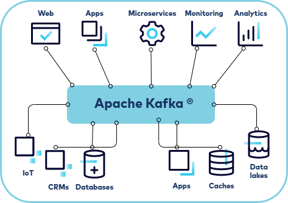
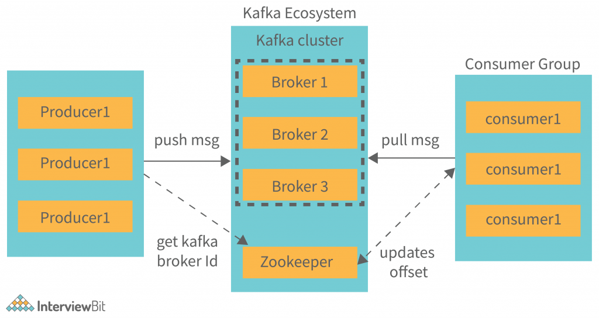

# Basic Kafka Concepts
                                    
*Following are some of the important Kafka concepts.*
       
### 1. What is Apache Kafka?

Apache Kafka is an open-source, distributed streaming platform designed for building real-time, data-intensive, and scalable applications. Originally developed by LinkedIn and later contributed to the Apache Software Foundation, Kafka is widely used for ingesting, processing, and transmitting high volumes of data in a fault-tolerant and low-latency manner.

Key features and concepts of Kafka include:

* Publish-Subscribe Messaging System: Kafka follows the publish-subscribe model. Producers (data senders) publish messages to topics, and consumers (data receivers) subscribe to topics to receive and process those messages.

* Distributed and Fault-Tolerant: Kafka is designed to be distributed and fault-tolerant. It runs as a cluster of broker servers, where each broker is responsible for handling a portion of the data. Data is replicated across multiple brokers to ensure high availability and durability.

* Log-Based Storage: Kafka stores messages in an immutable, distributed log format. Each message is assigned a unique offset, making it easy to retain and reprocess data as needed.

* Partitioning: Topics are divided into partitions, and each partition is hosted on a specific broker. This partitioning allows Kafka to horizontally scale by distributing data across multiple servers.

* Low Latency: Kafka is optimized for low-latency data transmission. It can handle real-time data streams, making it suitable for use cases like event-driven architectures and real-time analytics.

* Durability: Messages in Kafka are stored for a configurable retention period, even after consumers have processed them. This durability ensures that data is available for batch processing, reprocessing, and long-term analysis.

* Scalability: Kafka is highly scalable and can handle large amounts of data and high throughput by adding more broker servers and partitions as needed.

* Exactly-Once Semantics: Kafka provides strong guarantees for data delivery, supporting exactly-once message processing semantics for consumers.

* Stream Processing: Kafka's integration with stream processing frameworks like Apache Kafka Streams and Apache Flink allows real-time data processing and analytics on data streams.

* Ecosystem: Kafka has a rich ecosystem of connectors and integrations with various data sources and sinks, including databases, message brokers, and storage systems.

* Monitoring and Management: Kafka provides tools and metrics for monitoring the health and performance of Kafka clusters, such as Kafka Manager and Confluent Control Center.

* Security: Kafka supports various security features, including authentication, authorization, encryption, and data protection.

----------------------------------------------

### 2. What are some of the use cases of Apache Kafka?

Common use cases for Apache Kafka include:

1. Log Aggregation: Kafka is used to collect and centralize logs from multiple services and applications for real-time monitoring and analysis.

2. Event Sourcing: Kafka is used as an event store for applications that implement event sourcing architectures, allowing historical event data to be replayed for auditing, debugging, and analysis.

3. Real-time Data Streaming: Kafka serves as the backbone for real-time data streaming platforms, enabling the processing of real-time data for use cases like fraud detection, recommendation engines, and IoT data ingestion.

4. Data Integration: Kafka is used for data integration between different systems and applications, allowing data to flow in real-time or near-real-time.

5. Change Data Capture (CDC): Kafka is employed for capturing and streaming changes from databases to enable real-time data warehousing and analytics.

Apache Kafka's versatility, scalability, and performance make it a popular choice for building modern, data-driven applications and architectures. It has become a fundamental component of many organizations' data infrastructure, especially in the context of big data and real-time analytics.

----------------------------------------------

### 3. What are the components of Apache Kafka?

Apache Kafka is composed of several key components that work together to provide a distributed and fault-tolerant data streaming platform. These components are designed to ingest, store, and process high volumes of data in real-time or near-real-time. 

Here are the main components of Apache Kafka:

1. Producer:

    * The Producer is a client application or process responsible for publishing (producing) data to Kafka topics.
    * Producers send messages to Kafka topics, which are distributed channels for organizing and categorizing data.
    * Producers can choose which topic to send data to, and they can specify a key for the message to determine its partitioning.

2. Broker:

    * A Kafka Broker is a Kafka server instance that stores and manages the data.
    * Kafka operates as a cluster of brokers, where each broker is responsible for a portion of the data and serves clients (producers and consumers).
    * Brokers store the published messages in their distributed and immutable log files.

3. Topic:

    * A Kafka Topic is a named channel or category for data streams.
    * Producers publish messages to specific topics, and consumers subscribe to topics to receive and process those messages.
    * Topics can have multiple partitions to distribute the data across brokers for scalability and parallelism.

4. Partition:

    * Each Kafka Topic can be divided into multiple partitions, which are the basic unit of parallelism and distribution.
    * Partitions allow Kafka to horizontally scale and distribute data across multiple brokers and disks.
    * Each partition is ordered and assigned a unique offset, which represents the position of a message in the partition's log.

5. Consumer:

    * The Consumer is a client application or process that subscribes to Kafka topics and reads messages from partitions.
    * Kafka supports two types of consumer models: the low-level consumer API and the high-level consumer API.
    * Consumers can maintain their own offsets to keep track of the last message they have processed, providing resilience and data retention control.

6. Consumer Group:

    * Kafka consumers can be organized into consumer groups, which allows multiple consumers to work together to consume messages from one or more topics.
    * In a consumer group, each partition is assigned to only one consumer, ensuring that each message is processed by a single consumer within the group.

7. ZooKeeper:

    * While not part of the Kafka core architecture, Apache ZooKeeper is often used to manage and coordinate Kafka clusters.
    * ZooKeeper is responsible for leader election, broker registration, and cluster metadata management.
    * Note that ZooKeeper's role in Kafka is gradually being phased out in favor of Kafka's internal metadata management.

8. Kafka Connect:

    * Kafka Connect is a framework and set of connectors for integrating Kafka with various data sources and sinks.
    * Connectors facilitate data movement between Kafka topics and external systems such as databases, cloud storage, and messaging systems.

9. Kafka Streams:

    * Kafka Streams is a stream processing library and API that allows developers to build real-time, event-driven applications on top of Kafka.
    * It enables the development of stateful stream processing applications for data enrichment, transformation, and aggregation.

10. Kafka Clients:

    * Kafka provides client libraries for different programming languages, including Java, Python, Scala, and others, to develop producers, consumers, and custom applications that interact with Kafka clusters.

These components work together to form a distributed data streaming platform that is highly scalable, fault-tolerant, and capable of handling real-time data ingestion, processing, and distribution. Kafka's architecture is designed to support a wide range of use cases, from log aggregation and event sourcing to real-time analytics and data integration.

----------------------------------------------
