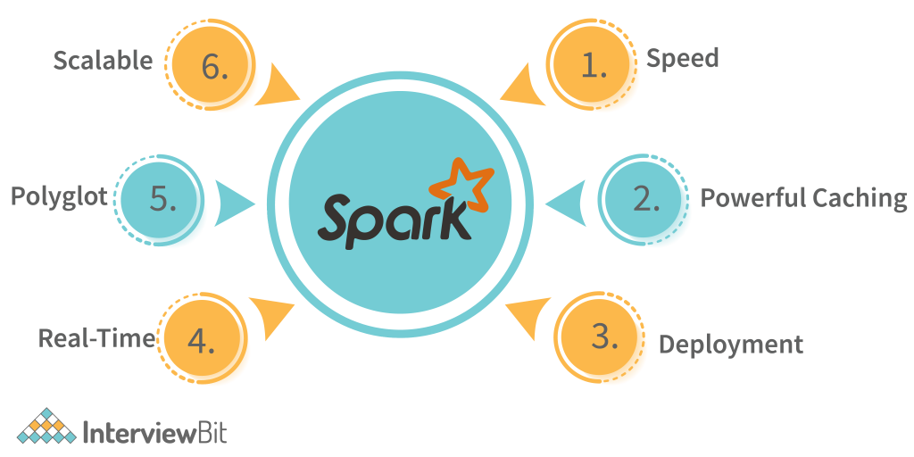
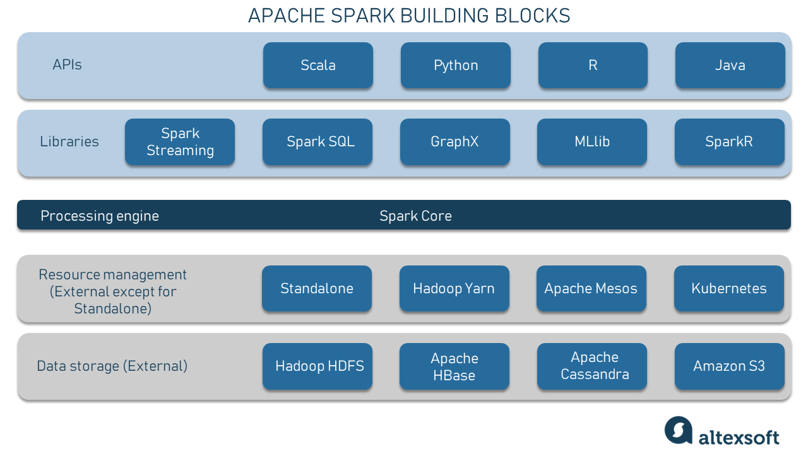
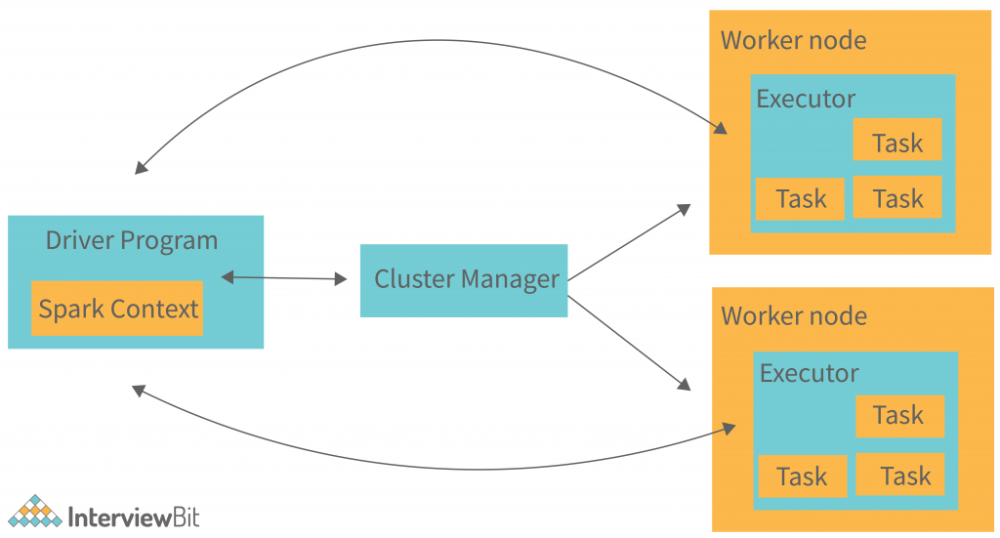

# Basic Spark Concepts

*Following are some of the important Spark concepts.*

### 1. What is Apache Spark?

Apache Spark is an open-source, distributed data processing framework designed for big data processing and analytics. It was developed at the University of California, Berkeley's AMPLab and later contributed to the Apache Software Foundation, where it has become one of the most popular projects in the big data ecosystem.

Apache Spark is known for its speed, ease of use, and versatility in handling a wide range of data processing tasks. It provides a high-level, expressive API for distributed data processing and supports various programming languages, including Scala, Java, Python, and R.

Key features and components of Apache Spark include:

1. Distributed Data Processing: Spark is designed for distributed data processing, allowing it to efficiently process large datasets across clusters of machines. It distributes data across nodes in a cluster and processes it in parallel, improving processing speed and scalability.

2. In-Memory Computing: One of Spark's distinguishing features is its use of in-memory computing, which allows it to store and cache data in memory rather than writing intermediate results to disk. This significantly accelerates data processing compared to traditional disk-based processing frameworks.

3. Resilient Distributed Datasets (RDDs): RDDs are the fundamental data structure in Spark. They are distributed collections of data that can be processed in parallel. RDDs are fault-tolerant, meaning they can recover from node failures by re-computing lost data partitions.

4. Data Processing Libraries: Spark includes libraries for various data processing tasks, such as Spark SQL for structured data processing, Spark Streaming for real-time data processing, MLlib for machine learning, and GraphX for graph processing. These libraries make it a versatile framework for different use cases.

5. Interactive Data Analysis: Spark supports interactive data analysis and exploration through its interactive shells, including the Spark Shell (Scala and Python) and Jupyter Notebooks. This enables data scientists and analysts to work with data interactively.

6. Cluster Managers: Spark can run on various cluster managers, including Apache Hadoop YARN, Apache Mesos, and its own standalone cluster manager. This flexibility makes it compatible with a wide range of cluster infrastructures.

7. Integration: Spark can be integrated with other big data technologies and storage systems, including Hadoop Distributed File System (HDFS), Apache Hive, Apache HBase, and more. It can also be used in conjunction with tools like Apache Kafka and Apache Cassandra for data ingestion and streaming processing.

8. Machine Learning: Spark's MLlib library provides a wide range of machine learning algorithms and tools for tasks such as classification, regression, clustering, and recommendation systems. It simplifies the development of machine learning pipelines on large datasets.

9. Streaming Processing: Spark Streaming enables real-time data processing and analytics by processing data in micro-batches. It is well-suited for use cases that require low-latency processing of streaming data.

10. Graph Processing: Spark's GraphX library provides graph processing capabilities, making it suitable for analyzing and processing graph data structures.

Apache Spark is widely adopted in industries such as finance, healthcare, e-commerce, and more, where large-scale data processing and analytics are essential. Its combination of speed, versatility, and ease of use has made it a popular choice for big data analytics and machine learning workloads.

----------------------------------------------

### 2. What are the componets of Apache Spark?

Apache Spark consists of several key components and libraries that work together to provide a unified, distributed data processing framework. These components enable Spark to handle various data processing tasks efficiently. Here are the main components of Spark:

1. Spark Core:

    * Spark Core is the foundational and essential component of Apache Spark.
    * It provides the basic functionality for distributed data processing, including task scheduling, memory management, fault recovery, and distributed data structures like Resilient Distributed Datasets (RDDs).
    * RDDs are the fundamental data abstraction in Spark, representing distributed collections of data that can be processed in parallel.

2. Spark SQL:

    * Spark SQL is a Spark module for structured data processing.
    * It allows users to execute SQL queries on structured data, such as tables and views, using Spark's distributed processing capabilities.
    * Spark SQL supports reading and writing data from various data sources, including Hadoop Distributed File System (HDFS), Apache Hive, Parquet, and more.
    * It also provides a DataFrame API for working with structured data in a more programmatic and type-safe way.

3. Spark Streaming:

    * Spark Streaming is a library for processing real-time data streams.
    * It enables the processing of data in small, continuous batches, often referred to as micro-batches.
    * Spark Streaming can consume data from various sources, including Kafka, Flume, and HDFS, and process it using Spark's core API or Spark SQL.
    * It is well-suited for use cases that require low-latency processing of streaming data, such as log analysis and real-time monitoring.

4. MLlib (Machine Learning Library):

    * MLlib is Spark's machine learning library, providing a wide range of machine learning algorithms and tools for data scientists and engineers.
    * It includes algorithms for classification, regression, clustering, recommendation, and more.
    * MLlib is designed for distributed machine learning and works seamlessly with other Spark components.

5. GraphX:

    * GraphX is Spark's library for graph processing and analytics.
    * It allows users to represent and process graph data structures, making it suitable for applications like social network analysis, fraud detection, and recommendation systems.
    * GraphX provides a flexible and expressive API for graph manipulation and computation.

6. Cluster Manager:

    * Spark can run on various cluster managers, including Apache Hadoop YARN, Apache Mesos, and its own standalone cluster manager.
    * The cluster manager is responsible for resource allocation and job scheduling across the cluster.

7. External Data Sources and Connectors:

    * Spark provides connectors and APIs to interact with various external data sources, including HDFS, Hive, HBase, Cassandra, and more.
    * These connectors allow Spark to read and write data from/to different storage systems and databases.

8. Interactive Shells and Notebooks:

    * Spark provides interactive shells and notebooks for Scala, Python, and R, allowing data scientists and analysts to interactively work with data, run Spark commands, and develop Spark applications.

9. Cluster Manager Integration:

    * Spark can be integrated with various cluster managers, enabling resource management and job scheduling in distributed environments.
    * Supported cluster managers include Apache Hadoop YARN, Apache Mesos, and Spark's own standalone cluster manager.

10. Monitoring and Debugging Tools:

    * Spark offers various tools and utilities for monitoring, debugging, and profiling Spark applications. These tools include the Spark web UI, logging, and third-party monitoring solutions.

These components and libraries make Apache Spark a versatile and powerful platform for distributed data processing, spanning batch processing, real-time streaming, machine learning, and graph analytics. Users can leverage the appropriate components and APIs to meet their specific data processing needs within a unified framework.

----------------------------------------------

### 3. What is the architecture of Spark?

Apache Spark's architecture is designed to efficiently process large volumes of data in a distributed and fault-tolerant manner. It uses a master-worker architecture and includes several key components that work together to enable distributed data processing. Here's an overview of Spark's architecture:

1. Driver Program:

    * The Driver Program is the entry point and control center of a Spark application.
    * It runs the user's main function and orchestrates the execution of tasks on the cluster.
    * The Driver Program creates a SparkContext, which is the entry point for interacting with Spark.

2. Cluster Manager:

    * Spark can run on various cluster managers, including Apache Hadoop YARN, Apache Mesos, and its standalone cluster manager.
    * The cluster manager is responsible for allocating resources (CPU, memory) and managing the execution of Spark applications across worker nodes in the cluster.
    * It communicates with the Driver Program to negotiate resources and launch worker nodes.

3. Worker Nodes:

    * Worker nodes are machines in the cluster that execute tasks for a Spark application.
    * Each worker node runs an instance of the Spark executor, which is responsible for running tasks, caching data, and managing resources.
    * Worker nodes communicate with the Driver Program and the cluster manager to receive tasks and report their status.

4. SparkContext:

    * The SparkContext is a central component in Spark and represents the connection to the Spark cluster.
    * It is created by the Driver Program and used to configure Spark and create RDDs (Resilient Distributed Datasets), which are the fundamental data abstraction in Spark.
    * The SparkContext coordinates the execution of tasks across the cluster.

5. Resilient Distributed Datasets (RDDs):

    * RDDs are distributed collections of data that can be processed in parallel across the cluster.
    * They are immutable and fault-tolerant, meaning they can recover from node failures by recomputing lost data partitions.
    * RDDs can be created from data in HDFS, local file systems, or other data sources.

6. Distributed Data Processing:

    * Spark uses a directed acyclic graph (DAG) scheduler to execute a sequence of transformations and actions on RDDs.
    * Transformations, such as map, filter, and reduceByKey, create new RDDs from existing ones.
    * Actions, like count, collect, and saveAsTextFile, trigger the execution of transformations and return results to the Driver Program.

7. Storage and Caching:

    * Spark allows data to be cached in memory across worker nodes, reducing the need to read from disk.
    * Data caching is particularly useful for iterative algorithms and interactive queries, as it speeds up data access.
    * Spark supports various storage levels to control the trade-off between memory usage and data access speed.

8. Cluster Coordination:

    * Spark uses cluster coordination mechanisms provided by the cluster manager to manage resources, handle task scheduling, and ensure fault tolerance.
    * It can recover lost data partitions and tasks by recomputing them on available worker nodes.

9. Shuffle Operations:

    * Shuffle operations involve redistributing data across worker nodes during certain transformations, such as groupByKey and join.
    * Spark optimizes shuffle operations to minimize data movement and improve performance.

10. Data Sources and Connectors:

    * Spark includes connectors and libraries to interact with various data sources, including Hadoop Distributed File System (HDFS), Apache Hive, HBase, and others.
    * These connectors enable Spark to read and write data from/to different storage systems and databases.

11. Additional Libraries:

    * Spark provides additional libraries, such as Spark SQL for structured data processing, Spark Streaming for real-time data processing, MLlib for machine learning, and GraphX for graph processing.

Apache Spark's architecture and components work together to provide a versatile, high-performance platform for distributed data processing, supporting a wide range of data processing tasks, from batch processing to real-time streaming and machine learning. Its ability to efficiently process large datasets across clusters of machines has made it a popular choice for big data analytics and processing workloads.

----------------------------------------------